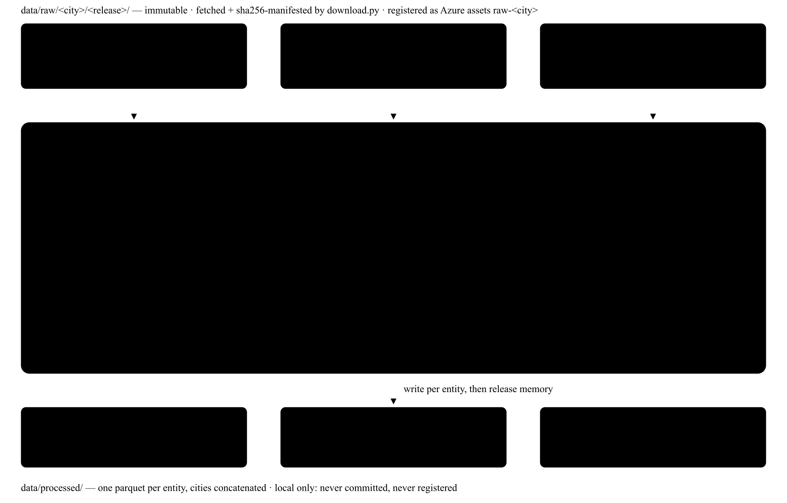

# Data pipeline design — the contract for `src/rental_ranking/data/`

This document is the reference for download, anonymisation, cleaning and filtering. Column-level
definitions, per-city null rates and source caveats live in
**[data_dictionary.md](data_dictionary.md)**, the source of truth this contract derives from.
Decisions and their rationale: [decisions_log.md](decisions_log.md).

## Markets and snapshots

| City | Release date | Observed `last_scraped` | Listings | Notes |
| --- | --- | --- | --- | --- |
| Thessaloniki | 2026-06-29 | 06-29, 07-02 | 4,965 | Smallest market |
| Athens | 2026-06-28 | 06-28, 06-29, 06-30 | 14,337 | Largest city market |
| Crete | 2026-06-29 | 06-29, **06-30**, 07-01, 07-03 | 27,333 | Region, not city: "neighbourhoods" are municipalities; seasonal market |

**Three dates, never conflated:**

- **Release date**: the folder name and the Azure data-asset version. Not a scrape date.
- **Row scrape date**: `last_scraped`, which varies *within* a city. Crete's modal value is
  2026-06-30, not the 06-29 in the folder name.
- **T**: the label anchor, defined below.

Every date computation is relative to the **row's own** dates. Never use a global reference date,
never the release date as if it were T, and never `max(last_review)`. Each misaligns cities.

## The label window points forward, anchored per listing

The calendar file covers 365 days forward from each listing's own scrape; there is no past calendar
in a snapshot. The occupancy demand proxy is **the fraction of blocked nights in the 90 days after
T**, where

> **T = `min(calendar.date)` for that listing**, equivalently its own first calendar row.

Per listing, not per city: scrape dates spread across up to four days inside one city, so a fixed
per-city T would give later-scraped listings a short or shifted window. With the per-listing anchor
the calendar-derived available-night count over the first 90 days reproduces `availability_90` for
**99.96 / 99.99 / 99.97 %** of listings (mean absolute difference ≤ 0.03 nights). Each listing's
calendar is contiguous, 365 rows for all but 8 listings (2 Athens, 6 Crete) which run 366–367, so
the 90-day window is always fully covered. Do not write code that assumes exactly 365.

`availability_90` is the label in column form. It is the standing cross-check for `label.py`, never
a feature.

Named biases to carry into validation: far-future nights are less booked simply because they are
further out, and blocked ≠ booked always, so demand-proxy language belongs everywhere. Because T
lands at the end of June, the window is July to September peak season, when
blocked-because-booked most plausibly dominates blocked-because-closed.

> **What the label encodes: a two-stage signal (measured 2026-08-03).** Mean blocked fraction rises
> monotonically with listing age in every city. Never reviewed / new this year / established runs
> 0.215 / 0.269 / 0.326 in Thessaloniki, 0.243 / 0.323 / 0.416 in Athens and 0.418 / 0.551 / 0.619
> in Crete, and about 30 % of each market is new since last summer. Restricting to established
> listings takes the same-season correlation to 0.097 / 0.153 / 0.135, which is why
> `reviews_per_month`, the one tenure-normalised signal, is the weakest of all of them. Before the
> dormancy rule the collapse was steeper, 0.034 / 0.151 / 0.065: a good share of the apparent
> confound was withdrawn listings sitting at label 1.0.
>
> Within the established cohort, **review quality orders the label**. By rating tercile (≥ 10
> reviews, so the rating is stable) mean blocked fraction runs 0.245 / 0.344 / 0.412 in
> Thessaloniki, 0.383 / 0.430 / 0.470 in Athens and 0.587 / 0.675 / 0.685 in Crete, and
> Thessaloniki's poorly-rated established listings (0.245) sit *below* its brand-new ones (0.269).
> The city ordering **inverts** between quality (ρ = 0.274 / 0.137 / 0.210) and volume
> (0.110 / 0.176 / 0.120). Ungated, Crete looks non-monotone only because its top rating band has a
> median of 7 reviews against 37 in the middle band, which is noise in the instrument rather than
> in the signal.
>
> **Claim: forward availability tracks listing establishment, and within the established cohort it
> is ordered by review quality.** Not: that the label measures demand among otherwise-comparable
> listings. Three standing limits. Airbnb ratings are ceiling-compressed (95th percentile 5.0
> everywhere), rating is 100 % null for never-reviewed listings, and "less blocked" cannot be
> separated from "the host left it open because it does not sell" without bookings or impressions.
> Survivorship works the other way: the worst low-rated listings delisted, so the measured gradient
> is attenuated.
>
> **Validation instrument.** Prefer a *same-season-last-year* review window, meaning reviews in
> `[T − 365, T − 365 + 90)`, anchored per listing. It is leakage-free and seasonally matched to the
> label window, unlike a trailing window from T, which lands in shoulder season. At equal 90-day
> width, where season is the only difference, it gives 0.150 / 0.226 / 0.233 against the trailing
> window's 0.119 / 0.196 / 0.277: it wins in Thessaloniki and Athens and loses in Crete, the most
> seasonal market, where recent activity tracks the coming summer better than last summer does. It
> wins while having *more* empty windows in two of three cities, so the gain is seasonal alignment
> rather than extra data. Extending it to absorb review-posting lag (104 / 110 / 120 days) was
> tested and does not help. Never pool across cities: the between-city gradient runs opposite to
> the within-city one (Crete is the most blocked market *and* the thinnest-reviewed), so a pooled
> correlation understates the signal.

Temporal design: all `listings.csv` attributes are known at T, and the label is what the calendar
says about after T. Features are as-of-T attributes. Calendar-derived and review-rate-derived
listing columns are **not** features (blocklist below).

> **Verified, and not quite universal.** The split holds exactly when `scrape_date <= T`. Measured
> on the ranked population, **26 listings (0.06 %)** breach it: 5 Athens, 21 Crete, thirteen by one
> day and thirteen by two, because the scrape ran across four calendar days. They are **kept**.
> Excluding them would be a fifth filter rule for 26 rows, and row exclusion belongs to
> `filters.py` with a threshold and a reported count. The breach is nominal rather than material,
> and that is measured rather than asserted: structural attributes cannot change in two days, the
> class that could is review-derived, and **none of the 26 has a review dated after its own T**.
> Notebook 02 §7 is the reference.
>
> The guarantee this buys is **feature provenance**, never a train/test split *in time*, since one
> snapshot has no second period. The holdout is a **grouped** split on
> `features/groups.py::cluster_id`, decided separately.

## Layered flow

```text
download.py     data/raw/<city>/<release_date>/    immutable + manifest (url, sha256, size,
                                                   downloaded_at, release_date)
                        │        (mirrored to Blob raw/ and registered per city/release)
anonymize.py    PII removal + ID hashing            lossless otherwise
clean (typing)  parsing, casting, dedup, bounds     lossless: no row dropped except integrity
                        ▼
data/processed/ ONE parquet per entity (listings, calendar, reviews) concatenated across
                cities with `city` + `scrape_date` columns; schemas asserted equal first
                        │
filters.py      applied at label-build time, never baked into processed data; identical
                criteria for all cities; per-city counts returned for reporting
                        ▼
feature table   registered as a versioned Azure data asset (job input)
```



Rules:

- **Preprocessing is lossless.** Row exclusion is an analytical decision that lives in
  `filters.py`, parameterised and revisable without re-processing. No rank-based outlier removal
  ("top 10 by min_nights") anywhere: thresholds only, identical across cities. Price *outliers* are
  still not removed. `is_extreme_price` is a multiple-of-stratum-median data-error guard (25 rows,
  worst at 374×), not a rank cut, and a ranker must rank expensive listings too. Price treatment
  otherwise belongs to grading and features.
- **Raw is forever.** Snapshots rotate off the public site, so the stored copy is the only path to
  reproduction. Raw files are never edited.
- **Registration is separate from download.** `download.py` fetches and manifests, and it must work
  with no Azure credentials at all. Asset registration is a one-time act per snapshot done after
  inspection, via the commands in [azure_setup.md](azure_setup.md), never inside `download.py`.
- Group key downstream is **city + neighbourhood_cleansed** (which avoids cross-city name
  collisions) × `room_type` × capacity tier. **Sizing warning:** Thessaloniki has only 7
  neighbourhoods, Shared room has 3 / 30 / 18 rows across the three cities, and Hotel room is
  absent from Thessaloniki, so this key will produce singleton groups, which contribute nothing to
  NDCG and waste LambdaMART's gradient.

  **Attribute and assembly are separate concerns.** A capacity **tier** is a listing *attribute*; a
  query **group** is an *assembly*. The tier is defined alongside the label, because price
  imputation consumes it as a cascade rung, while group assembly and the minimum-size rule come
  after. Both live in `features/groups.py`.

  Tier bounds are **1–2 / 3–4 / 5–7 / 8+**. `accommodates` takes 16 distinct values (1–16) with
  87 % of listings at ≤ 6, so leaving it raw fragments the key badly. Measured on the ranked
  population, these bounds give **516 groups, 71 singletons** and a median of 14. A five-tier split
  (7–8 / 9+) costs 62 more groups and 13 more singletons for no gain; a three-tier split (5+)
  reaches 432 / 44 but lumps 5-guest and 16-guest properties into one search intent. The 5–6 / 7+
  cut measures identically (517 / 64, same cascade fills), so 5–7 / 8+ wins on semantics: capacity
  clusters on even values (5 = 9.1 %, 6 = 11.7 %, **7 = 2.7 %**, 8 = 4.3 %), so `8+` starts the top
  tier on a real party size rather than a near-empty one.

  **Group construction: minimum size 5, with a two-rung fallback that drops the *neighbourhood*
  dimension and then the *capacity* one.** Undersized groups rank against
  `city × room_type × capacity_tier`, and if they are still short, against `city × room_type`.
  Measured, as groups / singletons / under 5 / median size: **516 / 71 / 153 / 14** with no
  minimum, **399 / 6 / 15 / 28** after one rung, **393 / 0 / 7 / 29** after both. Rung usage is
  44,395 / 255 / 34. The second rung is worth taking for 34 listings (0.08 %) because it is what
  reaches **zero singletons**, and a singleton group is strictly worthless to LambdaMART: one
  document, no pair, no gradient. The terminal rung takes what it is given, so 7 groups remain
  under five rows and are kept rather than dropped.

  **The fallback pools the fallers; it never re-opens a healthy group to absorb them.** A group
  that clears the minimum is settled and untouched, so widening the search for the listings that
  lack a comparison set never coarsens the population that already has one. Each rung is re-tested
  against the minimum, so a pooled group that is still short falls again.

  **Every rung must retain the grading partition's columns** (`city`, `room_type`), which is why
  the cascade drops only `neighbourhood_cleansed` and `capacity_tier`. A rung that dropped
  `room_type` would put two grading cells inside one query group and break the coarsening guarantee
  below. `groups.query_group` checks this against `label.DEFAULT_PARTITION_COLS` and raises rather
  than trusting the constant.

  **No threshold on `neighbourhood_cleansed` itself**, and no spatial merging of sparse
  neighbourhoods, because thresholding one factor cannot fix a product. Of those 289 listings, only
  a minority sit in a neighbourhood below 50 listings; most are in neighbourhoods of 100+ (Χανίων
  holds about 6,000). Merging was rejected on measurement too: sub-50 neighbourhoods sit 0.6 km
  apart in Athens but **16.6 km median, 39.8 km max in Crete**, so a merge would invent exactly the
  incoherent group the fallback avoids.

  **Near-twin listings are a splitting problem, not a filtering one.** Listings sharing a host, a
  point to 4 dp and a capacity are **15.6 / 16.2 / 9.4 %** of each market: 1,923 clusters, largest
  26. They look like duplicates and are not. Only **5.8 %** share a calendar and **15.3 %** a review
  count, and the median within-cluster spread in review count is 7. They are distinct inventory,
  one operator with several identical flats, so dropping them would delete 12 % of real supply,
  concentrated in exactly the commercial-operator population the fairness pass studies. What they
  *do* create is leakage: median within-cluster label spread is 0.079, so twins on both sides of a
  random split let a model memorise the pair. The remedy is a **grouped split** on
  [`features.groups.cluster_id`](../src/rental_ranking/features/groups.py), where every cluster
  member lands wholly in train or wholly in test. No rows lost.

## Anonymisation policy

Threat model: the *publication* boundary, meaning the repo, notebook outputs and README. Private
local disk and the private Blob container are storage, not publication. Data under `data/` is never
committed, and processed data is what notebooks load, so it is PII-free by construction.

- **IDs** (`id`, `host_id`, and `listing_id` in calendar and reviews, consistently, or every join
  breaks): salted SHA-256, truncated to **12 hex chars**. The salt lives in `.env` (`ANON_SALT`)
  and is never committed. Rationale: 6-hex MD5 gives expected collisions at 40k+ listings, and
  unsalted hashes of public enumerable IDs are reversible by dictionary.
- **Dropped outright**: `host_name`, `host_thumbnail_url`, `host_picture_url`, `host_url`,
  `host_profile_id`, `host_profile_url`, `reviewer_id`, `reviewer_name`. `host_profile_id` is
  verified 1:1 with `host_id`, so dropping it loses nothing, and hashing a second host key would
  only invite an inconsistent join.
- **Derived then dropped**: `host_location` → `host_is_local` (three-way, because the column is
  34–37 % null, so "unknown" is a real category rather than an imputation) · `host_about` →
  `host_has_about` presence flag · `license` → `license_status` (registered / exempt / missing) plus
  a salted-hashed value. The licence hash earns its keep: only 2.8–4.3 % of rows are null (Greece's
  AMA registry), and duplicate licence numbers cover 369 / 2,204 / **10,925** listings, a strong
  commercial-operator signal.
- **Kept raw**: listing `name`, which is marketing copy rather than host PII, though published
  notebook cells must not render name-bearing rows gratuitously; revisit if a processed *dataset*
  is ever published. Coordinates are kept **unrounded**: Airbnb already jitters them 0–150 m at
  source, so rounding only degrades spatial features. Per-city bounding-box *validation* stays in
  cleaning.

## Column spec — listings

Encoded as a literal spec in
[`src/rental_ranking/data/columns.py`](../src/rental_ranking/data/columns.py), which the inventory
notebook asserts against. Per-column evidence and null rates:
[data_dictionary.md §4](data_dictionary.md). The lists below and that module must agree.

**Drop, empty (100 % null in all three cities, verified):** `neighborhood_overview`, `host_since`,
`host_response_time`, `host_response_rate`, `host_acceptance_rate`, `host_thumbnail_url`,
`host_neighbourhood`, `host_total_listings_count`, `host_verifications`, `neighbourhood`,
`neighbourhood_group_cleansed`, `calendar_updated`, `instant_bookable`.

**Drop, other:** `listing_url`, `scrape_id`, `source` (no variance in Athens), `picture_url`,
`description`, `host_url`, `host_picture_url`, `calendar_last_scraped` (duplicate of
`last_scraped`), `has_availability` (constant `t`; only its nullity varies, and that tracks the
label), `minimum_minimum_nights`, `maximum_minimum_nights`, `minimum_maximum_nights`,
`maximum_maximum_nights`, `maximum_nights_avg_ntm` (keeping `minimum_nights_avg_ntm` as the one
calendar-rule representative), `price_quote_total_price` and `price_quote_price_per_night` (exact
duplicates of `price`), `price_quote_raw` (restates the quote dates in JSON, about 1 KB/row).

**Derive, then drop the raw column:** `last_scraped` → `scrape_date` · `host_location` →
`host_is_local` (**three-way** {local, remote, unknown}, since the column is 34–37 % null) ·
`host_about` → `host_has_about` · `license` → `license_status` ∈ {registered, exempt, missing} plus
a salted hash of the number · the four `hosts_time_as_*` → `user_tenure_months` and
`host_tenure_months` (`years*12 + months`; the `_months` fields are 0–11 remainders).

> **Why the tenure fields are kept.** `host_since` is 100 % null, so `hosts_time_as_*` are the
> *only* tenure signal, and user tenure ≠ host tenure (the years agree in only 62–77 % of rows), so
> both derivations stay. `host_listings_count` is kept for the same kind of reason: the two counts
> it might otherwise defer to include `host_total_listings_count`, which is empty.

**Keep, core:** `id` (hashed), `host_id` (hashed), `name`, `neighbourhood_cleansed`, `room_type`,
`accommodates`, `price` (parse and impute, see below), `minimum_nights`, `maximum_nights`,
`minimum_nights_avg_ntm`, `number_of_reviews`, `number_of_reviews_ltm`, `number_of_reviews_l30d`,
`number_of_reviews_ly`, `first_review`, `last_review`, `reviews_per_month`.

`number_of_reviews_ly` is confirmed to be the **calendar-2025** review count (exact match against
`reviews.csv`, all three cities). All of 2025 precedes every T, so it is leakage-free and
`ltm − ly` is a clean momentum feature.

**Keep, features:** `latitude`, `longitude`, `property_type`, `bathrooms`, `bathrooms_text` (the
near-complete one, reconciled into numeric plus a shared flag), `bedrooms`, `beds`, `amenities`, the
seven `review_scores_*`, `host_is_superhost`, `host_identity_verified`, `host_has_profile_pic`,
`host_listings_count`, `calculated_host_listings_count`,
`calculated_host_listings_count_entire_homes`, `calculated_host_listings_count_private_rooms`,
`calculated_host_listings_count_shared_rooms`.

**Keep but feature-blocklisted** (validation and asserts only; exported as
`LABEL_ADJACENT_COLUMNS`, imported by the feature code and checked by a test): `availability_30`,
`availability_60`, `availability_90`, `availability_365`, **`availability_eoy`**,
`estimated_occupancy_l365d`, `estimated_revenue_l365d`, **`price_quote_checkin_date`**,
**`price_quote_checkout_date`**.

> **The quote dates are a target leak.** `price_quote_checkin_date` is the listing's first available
> calendar date in 91.5 / 86.5 / 68.5 % of rows; Spearman correlation between quote lead and
> blocked-fraction-90 is 0.56–0.67, and where the quote date is null, mean blocked-fraction-90 is
> 0.98–0.99. Inside Airbnb's scraper walks forward until it finds an opening, so the date it lands
> on *is* the availability signal. They stay in the processed data only so notebook 01 can
> demonstrate the leak. `availability_eoy` joins them: it is a forward availability window (0–186
> days) that fully contains the label window.

## Price is endogenous

`price` is not a standing nightly rate. It equals `price_quote_price_per_night` exactly, meaning it
is the per-night figure from a quote for a dated stay, and that date is chosen by availability. Two
consequences, of different severity:

- **Missingness is severe.** `price` is null in 5.0 / 1.0 / 6.6 % of rows, and 84 / 15 / 68 % of
  those have `availability_90 == 0`. **Never expose a price-missingness indicator as a feature**,
  and do not pass NaN through to LightGBM, whose native missing handling would split directly on
  the leak. **Impute** from the `city × neighbourhood_cleansed × room_type × accommodates` median.
  Rows needing this after the filters: **33 / 120 / 541**, or 0.7 / 0.8 / 2.1 %. The dormancy rule
  removed most of what used to need imputing, 1,817 rows before it and 694 after, because a
  withdrawn listing has no available date for the scraper to quote. Dropping the remainder would
  still systematically delete the highest-demand listings.

  **The cascade stays a contract term** even though it now resolves in two rungs: a thinner snapshot
  would need the lower ones, and the `city` rung is the guaranteed terminator. Rows resolved at each,
  measured:

  | rung | fills | still open |
  | --- | ---: | ---: |
  | `city × neighbourhood × room_type × accommodates` | 692 | 2 |
  | `city × neighbourhood × room_type × capacity_tier` | 2 | 0 |
  | `city × neighbourhood × room_type` | 0 | 0 |
  | `city × room_type` | 0 | 0 |
  | `city` | 0 | 0 |

  The capacity-tier rung is the reason the tier is defined alongside the label. **The key is
  structural throughout**, never cohort, listing age or `rating_shrunk`; see the decisions log.

  **The fill is a median, and that was tested rather than assumed.** Held out leave-one-out against
  8,000 rows that do have a price, median absolute error: `city` 39.6 %, `city × room_type` 39.5 %,
  `city × room_type × accommodates` 28.6 %, **this cascade 26.3 %**, a haversine KNN (k=5, within
  `city × room_type × capacity_tier`) 23.9 %. The KNN wins and is still rejected: the floor is about
  24 % either way, it touches 1.6 % of rows on a feature that no longer feeds the target,
  `KNNImputer` over the listings frame would silently adopt behavioural neighbours, and it averages,
  which is the wrong statistic at skew 6.5.
- **Value contamination is mild.** Within `room_type × accommodates × neighbourhood` strata, median
  relative price shifts only 0.98–1.05 / 0.95–1.01 / 0.78–1.07 across quote-lead buckets. Usable
  with a stated caveat.

  This once argued for a **price tier**, and that artefact is **withdrawn**. Its only consumer was
  the grading partition, and a price tier cross-cuts the query-group key instead of coarsening it;
  see "Grading partition" below. Rank-within-market survives as a possible *feature*, a continuous
  within-city price percentile, where the same argument holds without touching the target.

## Column spec — calendar and reviews

- **calendar (5 columns, verified):** keep `listing_id` (hashed), `date`, `available`. Drop the
  per-date `minimum_nights` and `maximum_nights`, which fall inside the label window; the
  listing-level values are kept instead. **There is no `price` or `adjusted_price` column in v4.7**,
  so no per-date price exists anywhere in this project and the question of a window-average asking
  price is void.
- **calendar join integrity:** Athens' calendar carries 5 `listing_id`s with no matching listings
  row, while Thessaloniki and Crete match exactly. Notebook 01 asserts this and the resolution is
  explicit rather than silent. **Reviews are not clean either:** one of those same five also carries
  2 review rows, so the reviews table has 1 orphan `listing_id` in Athens and none elsewhere.
  `tests/test_io.py` pins the exact orphan set per city, so a *new* orphan fails rather than being
  absorbed by a tolerance.
- **reviews:** keep `listing_id` (hashed), `id`, `date`, `comments`. Reviewer fields dropped as PII.

## Filters (`filters.py`)

Applied at label-build time, identical thresholds per city, with per-city **per-rule** removal
counts returned. **Four rules:**

| rule | Thessaloniki | Athens | Crete | total |
| --- | ---: | ---: | ---: | ---: |
| `is_inactive`: zero reviews ever **and** fully blocked label window | 75 | 101 | 523 | 699 |
| `is_long_term`: `minimum_nights` > 30 (de facto long-term rental) | 25 | 1 | 43 | 69 |
| `is_dormant`: ≥ 99 % blocked across the **whole** calendar | 222 | 2 | 1,279 | 1,503 |
| `is_extreme_price`: > 20× the listing's own stratum median | 4 | 14 | 7 | 25 |
| caught by more than one rule | 48 | 0 | 295 | 343 |
| **removed** | 277 | 118 | 1,556 | **1,951** |

Measured against `data/processed/`: 1,951 of 46,635 rows, 4.2 %; **44,684 survive**.

> **Dormancy, and why it spans the whole year.** These listings carry review histories (median 9
> reviews, so `is_inactive` never sees them) but were last reviewed a median of **540 days** before
> T against 43 for the ranked population, and **94 % of them sat at a label of exactly 1.0**, the
> top grade. They are withdrawn rather than booked, and `minimum_nights > 30` is already gone, so
> nothing legitimate is blocked for twelve straight months. A narrower construction, blocked across
> days 90–359 only to keep the rule independent of the label window, was tested and flags **1,493
> seasonal operators** actively selling during the summer, which in a Greek market is the core
> population. A seasonal listing is open in the window by definition, so only the whole-year rule
> avoids catching one. Removing dormant listings moved every headline number in the label's favour:
> ρ 0.124 / 0.225 / 0.194 → **0.150 / 0.226 / 0.233**.
>
> **Extreme price is a data-error guard, not an outlier cut.** 25 rows above 20× their stratum
> median, worst at 374×; the contract's ban on rank-based price removal stands. Nulls are never
> flagged: price missingness tracks the label and is imputed, never filtered.

Nothing else. No price-based row removal beyond that guard, and **no deduplication**; see the
group-key section for why near-twin listings are a splitting problem rather than a filtering one.

`is_long_term` is a safety net rather than a material filter here, covering only 0.50 / 0.01 /
0.16 % of rows. Keep it, because thresholds identical across cities are worth more than the rows
they remove, but do not expect it to change any distribution.

> **A fifth rule, "first review inside the label window", is void.** Measured: it removes **0 rows
> in all three cities**, and it cannot do otherwise. The reviews file ends at the scrape date and
> T ≈ the scrape date, so `first_review > T` is impossible by construction under a **forward**
> window. The thin-history population it was reaching for does exist, at 59 / 202 / 518 listings
> whose first review fell within 30 days of T, and it is deliberately **kept**: that is the
> cold-start cohort, flagged by `has_reviews` and studied in notebook 04 §8. Filtering it would
> delete the population the evaluation is partly about.

**Ordering constraint.** Filters run *before* price imputation and grading, because quantile
boundaries must be computed on the population that will actually be ranked. Note also that
`is_inactive` removes exactly the (zero reviews, blocked fraction = 1.0) corner, so it mechanically
raises the label's correlation with review signals. Label validation must report that correlation
both **before and after** filtering, or the validation is partly circular.

## Grading partition

**A grading partition must be a coarsening of the query-group key, never a cross-cut of it.** The
query key is `city × neighbourhood_cleansed × room_type × capacity_tier`. If every listing in a
group falls in one partition cell, the grade is a monotone step function of the label *inside that
group*, so the target can never contradict the label. If the partition cross-cuts the key, two
listings in the same group are quantiled against different populations and their grade order can
oppose their label order, on a target LambdaMART trains to reproduce.

Provable, and measured across the 516 query groups of the ranked population:

| grading partition | cells | query groups with an inversion |
| --- | ---: | ---: |
| `city` | 3 | **0** |
| **`city × room_type`** *(chosen)* | **11** | **0** |
| `city × room_type × capacity_tier` | 41 | **0** |
| `city × neighbourhood_cleansed` | 75 | **0** |
| the query group itself | 516 | **0** |
| `city × room_type × price_tier` | 29 | **163** |
| `city × price_tier` | 9 | **168** |

The chosen partition is **`city × room_type`**, with a fallback to `city` for any cell holding fewer
than 30 interior rows (2 cells, 31 rows: Athens and Crete Shared room). Room type earns its place on
gradient, since mean label spread across its levels is 0.027 / 0.222 / 0.146 per city.
`capacity_tier` passes the coarsening test too and is left out only because it adds nothing on top
of room type; `price_tier` fails the test outright and is withdrawn. Grade **shares are invariant**
to the choice under the chosen scheme, so the partition decides only which listings above the atom
get grade 1 rather than 2, 3 or 4.

**Consequence for price.** Nothing derived from `price` touches the target: no tier, no partition,
no grade. Imputation quality is a feature-quality question only, which is why the median cascade
above is sized to the stakes rather than to precision.

### The scheme: reserve the zero atom, quartile the rest

**Scheme E.** `label == 0.0` is grade 0, and everything above it is quartiled into grades 1–4
within the partition.

Measured, **the whole cold-start benefit comes from the zero atom**: reserving both atoms and
reserving only the zero atom both leave 8.0 % of never-reviewed listings in grade 0, against 38.6 %
under plain quintiles, while reserving only the *1.0* atom reaches 43.9 %, worse than quintiles.
Reserving 1.0 as well is therefore pure cost: a 2.6 % top class present in only 41 % of query groups
against 73 %, and a single blocked night out of ninety deciding a grade boundary on a label where
blocked is not booked. The dormancy rule had already removed the reason to reserve it, since every
listing now at 1.0 carries reviews (132 / 372 / 664, median 18.5 / 12 / 8).

**Cuts land on the label's value, not its rank** (`pd.qcut`, left-open and right-closed), so every
listing sharing a label value shares a grade and the grade is provably non-decreasing in the label
inside each cell. On the real snapshots the tie rate is **0 %**, against 5.8 % under rank-based
quintiles. The price is quartiles that are not exactly equal, because a boundary value takes its
whole tie group into the lower bin.

| measured from `label.assign_grades` | |
| --- | --- |
| grade shares 0…4 | 3.4 / 24.6 / 24.1 / 24.4 / 23.4 |
| mean label by grade | 0.000 / 0.168 / 0.413 / 0.602 / 0.829 |
| identical label → different grade | 0 % |
| never-reviewed in grade 0 | 8.0 % (2.38× the rate the grade holds overall) |
| zero-variance query groups | 27 of 516 → **10 of 393** with the min-5 cascade (48 listings) |
| distinct grades per multi-row group | 3.91 → 4.27 |
| groups reaching grade 4 | 72.9 % → **87.3 %** |

Two limitations that belong in the write-up rather than in a reviewer's question. **Grade 0 is not
per-city comparable**, because it is an absolute criterion while grades 1–4 are within-partition
quantiles, so it holds 7.1 % of Thessaloniki against 2.0 % of Crete. And **cold-start listings
remain over-represented in grade 0** at 2.38× the base rate: scheme E moves far fewer of them there,
it does not make the bottom grade unbiased.

Undersized cells are graded against the **whole** fallback population, never against each other.
Pooling the undersized rows and quantiling them among themselves would spread five listings over all
four grades and defeat the minimum entirely.

## The listing feature block

`features/listing.py` and `features/amenities.py`, both pure `DataFrame → DataFrame`. Everything in
the block is an attribute of the property or its operator at the scrape, so the pre-T rule holds by
construction: no calendar read, no review read.

**Nothing is imputed.** `price` remains the sole imputed column in the project, filled earlier for a
reason that does not generalise, since its missingness sits on a mechanical path from the label.
`bedrooms` (7.5 % null), `beds` (3.7 %) and `bathrooms_shared` (0.1 %) pass through as NaN, which
LightGBM handles by learning a split direction. The decisive measurement is in the decisions log:
**within a query group, the mean label percentile of a null-`bedrooms` listing is 0.498 against
0.505**. The marginal per-city gap is composition, differenced out by the group because `room_type`
is a key column.

**Excluded, and why.** Each is a judgement worth re-reading rather than re-deriving:

| column | disposition | reason |
| --- | --- | --- |
| `host_id`, `license_hash` | never a feature | 18,088 / 33,246 near-unique values; memorising operators, not ranking |
| `minimum_nights_avg_ntm` | excluded despite `KEEP` | "next twelve months" is computed over a window containing the label window. Differs from `minimum_nights` in 43 % of rows, so not merely redundant. **The contract's KEEP disposition and the pre-T rule disagree here; the pre-T rule wins** |
| `host_identity_verified`, `host_has_profile_pic` | dropped | 99.1 % / 96.0 % constant, so no pair inside any group can be separated by them |
| `name`, `description` | deferred | text features, not built |
| review and geo columns | elsewhere | the review and spatial blocks own them |

**`property_type` is decomposed.** Its 81 values conflate occupancy, which `room_type` already
states and which the group key conditions on, with building type. The occupancy prefix is stripped,
leaving **58 building types** (rental unit 21,376, condo 6,251, home 6,245, villa 5,711) which,
unlike `room_type`, vary *inside* a query group and can therefore rank.

**Group-key columns are conditioners, not discriminators.** `room_type` and `city` are constant
within almost every query group, so they separate no pair; they are carried because a tree uses them
to condition other features. Expect them high in split counts and absent from any honest reading of
"what makes a listing rank".

**Amenities: canonicalisation plus a 19-bucket concept map**, counts rather than flags. The
vocabulary is 7,029 strings with 93 % under 0.1 % prevalence, and the map covers **98.9 % of 1.74 M
mentions**. Counts, because 8 of the 19 buckets are near-universal on presence (connectivity_work
99.2 %, air_conditioning 98.7 %, kitchen 98.2 %) where a flag is dead weight, and because a count
subsumes a flag, since a tree recovers presence by splitting at zero. The alternative encodings
(`count`, `flags` over a pinned vocabulary) live behind one `scheme` parameter and are compared on
**validation** NDCG, never on test. Full reasoning, including why a hand-weighted convenience score
was rejected in favour of a partition, is in the decisions log.

## Neighbourhood aggregates

`features/aggregates.py`. Leave-one-out, unconditionally, over `city × neighbourhood_cleansed`
(75 units, median 168 listings, max 5,773, **one of size 1** which yields NaN, never zero).

**The aggregate this project does not build: a neighbourhood mean label.** Leave-one-out is the
standard fix for self-inclusion, and against this group key it is not a fix. It is the leak. 365 of
393 query groups sit inside a single neighbourhood, so within a group the total and size are
constant and the LOO mean is `S/(n−1) − xᵢ/(n−1)`, an exact affine decreasing function of the
listing's own label: **within-group Spearman exactly −1.000 in 100 % of those groups**. The
include-self version is the mirror failure, constant within group and therefore ranking nothing.
This extends "never aggregate the label at query-group scale" one level up, because with this key
the neighbourhood *contains* the group. Full measurement in the decisions log.

**Built instead:** `nbhd_listings` (LOO count), `nbhd_median_price` (LOO median, for `price.py`'s
skew reason) and `price_vs_nbhd`. The first two are **conditioners**, with within-group variance
ratios of 0.015 and 0.034, like `room_type` and `city`. The ratio is the one that earns its place at
1.147 against `price`'s 0.757: it is monotone in price *within* a group, so it adds no local
ordering, but it lets one split ("1.3× the local median") transfer across neighbourhoods where
"price > 150" must be relearned in each.

**Leave-one-out is unconditional.** The include-self gap is exactly `(xᵢ − μ)/(n−1)`, so it decays
as 1/(n−1): about 3 % of a listing's deviation at n = 30, 0.1 % at n = 1,000, and 0.0004 on average
here. Restricting it to small neighbourhoods buys nothing and costs a threshold, a branch, and a
feature whose definition changes discontinuously at it.

## Review sentiment: measured, and not a feature

Decided before any spend. Sentiment is a *demonstration* of the Azure AI Language path, not a model
input. `features/sentiment.py` holds the demo aggregation and no feature block.

Piloted locally at zero cost on an ephemeral environment: 80 **whole** query groups, 1,643 listings,
14,525 reviews scored with a multilingual XLM-R sentiment model. Measured **within query groups**,
the only comparison a pairwise ranker makes, mean ρ against the label:

| signal | mean within-group ρ | median |
| --- | ---: | ---: |
| `review_scores_value` | **+0.128** | +0.140 |
| `review_scores_rating` | +0.082 | +0.109 |
| sentiment | +0.049 | +0.036 |
| **sentiment, rating partialled out** | **+0.015** | +0.015 |

**The ceiling test is the decisive one.** Among the 463 listings at rating ≥ 4.95, where the rating
cannot separate anything, sentiment genuinely varies (sd 0.117), so it *does* de-compress the
ceiling. But ρ against the label among them is **−0.026**. The mechanism works and the signal is not
there.

**Aspect mining fails on coverage, not on signal.** The aspects with usable coverage are the ones
Airbnb already ships as numeric sub-scores (clean 85.7 % of listings, location 80.7 %, median 2
mentions each). The unrated aspects that could add something (noise 45.4 %, bed 23.7 %, parking
17.8 %, wifi 17.5 %, AC 13.1 %) have a **median of zero mentions per listing**.

> **For the write-up.** The honest headline is a negative result, and it is stronger than the
> feature would have been: *we asked whether what guests write adds anything to the score they
> already gave, inside the groups the ranker actually compares, and it does not.* Sentiment
> reproduces about half the rating (ρ ≈ 0.47) and the half it does not reproduce carries no demand
> signal. The corollary is the more interesting sentence: Airbnb's own `review_scores_value`
> outperforms it by 2.6×, is free, and was sitting unused in the schema. Shipping a feature worth
> +0.015 would have been decoration; measuring it before spending was the point.

Two rules survive the decision. **Cache raw responses before any aggregation** and **never call
inside a loop over listings**. Both apply to the demo run exactly as they would to a production one.

## The feature table


`features/assemble.py` is a pure transform; **`features/build.py` is the only module that writes
`data/features/`**, exactly as `data/build.py` is the only module that writes `data/processed/`. Run
it with `uv run python -m rental_ranking.features.build`.

**44,684 rows × 66 columns, of which 61 are features**, sorted by `query_group` because LightGBM
reads its group array positionally and never sees the ids.

| role | columns |
| --- | --- |
| identifiers | `id`, `query_group`, `cluster_id` |
| targets | `grade` (the LambdaMART target), `blocked_fraction_90` (carried for analysis, never an input) |
| features | structural 11 · host 10 · amenity 20 · review 14 · neighbourhood 3 · spatial 3 |

**The trainer takes its input list from `feature_columns()`, never from `table.columns`.** That one
line is the difference between training on the features and training on the answer.

Five checks raise rather than warn, each guarding a failure that yields a *working* model rather
than an error: no `LABEL_ADJACENT_COLUMNS` member (read live from `columns.py`, so a future
snapshot's blocklist is enforced without editing anything); no label-side diagnostic (`avail_90` is
the label's own numerator, `blocked_fraction_calendar` spans the window and the rest of the year,
`T` and `scrape_date` identify the scrape batch); one row per listing; sorted into contiguous group
runs; and no null identifier or target.

**Nothing in the matrix is imputed.** `price` remains the project's sole imputed column. Nulls: the
review cohort at 16.3 %, `bedrooms` 7.5 %, `beds` 3.7 %, `bathrooms_shared` 0.1 %, and the one
lone-neighbourhood row in the aggregate block. The six review **sub**-scores carry 2–3 nulls beyond
the never-reviewed cohort, from a lone reviewer who gave an overall score and skipped the
sub-categories, so "null iff never reviewed" holds for `review_scores_rating` and not for its parts.

## Azure data assets

Register exactly two layers: **raw** per city per release (`uri_folder`, version = release date)
after upload to Blob `raw/`, and the **feature table** that the training job consumes. The
intermediate processed parquet stays local. PII in raw is fine, because the container is private and
anonymisation gates publication rather than storage.

## Pipeline mechanics

Small pure functions (DataFrame in, DataFrame out) in `src/rental_ranking/data/`, chained by one
thin orchestrator, with unit tests per function. **No per-function Azure ML components**, which
would be ceremony without demonstration value at this scale. If the pipeline pattern is worth
demonstrating, one two-step pipeline YAML (prep → train) makes the point.

## Dependencies settled

Added: `pyarrow` (parquet), `scipy` (direct import in `eda.py`). Rejected: `squarify` (treemap
dropped from EDA), `geopy` (vectorised haversine instead), `requests` (stdlib `urllib` suffices for
four files per city).
