# Ranking short-term rental listings

**A learning-to-rank system built on 44,684 listings from public Inside Airbnb data for Athens,
Thessaloniki and Crete, trained locally and deployed on Azure ML.**

When someone searches for a place to stay on a short-term rental website, hundreds of listings
match. This project builds a ranking model that decides which listings appear first. It starts by
constructing a training target that approximates guest demand and ends by measuring the model
on unseen data, inspecting every step in between. It closes with an A/B test design written for the
marketplace such a model would live in.

---

## The result, up front

Model performance on the sealed test set (about a fifth of the data):

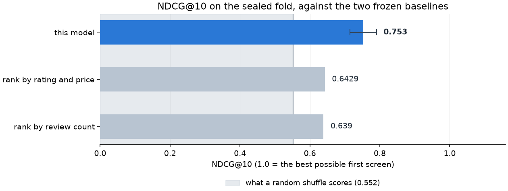

| ranker | NDCG@10 | |
|---|---|---|
| **this model** | **0.7530** | 95 % interval [0.7148, 0.7903] |
| rank by good rating and low price | 0.6429 | frozen before the model existed |
| rank by number of reviews | 0.6390 | frozen before the model existed |
| **random shuffle** | **0.5519** | the floor |

Read the floor first. NDCG normalises against the best possible ordering *within* each search, so
with ten slots and a decent share of good listings even a random shuffle gets a lot of it right.
**The usable range is 0.55 → 1.00, not 0 → 1.** The model covers 44.9 % of that range.

Two important caveats:

1. **The target is forward calendar availability, not demand.**
2. **The model buries good new listings worse than chance.**

Both are measured in §10.

### Contents

1. [The biggest challenge: nobody publishes what guests chose](#1-the-biggest-challenge-nobody-publishes-what-guests-chose)
2. [One column that gave away the answer](#2-one-column-that-gave-away-the-answer)
3. [What counts as one search](#3-what-counts-as-one-search)
4. [Turning availability into a training target](#4-turning-availability-into-a-training-target)
5. [Validating the target before trusting it](#5-validating-the-target-before-trusting-it)
6. [Features, and the ones left out](#6-features-and-the-ones-left-out)
7. [Train-test splitting and baselines](#7-train-test-splitting-and-baselines)
8. [How it scores](#8-how-it-scores)
9. [Five checks before trusting the result](#9-five-checks-before-trusting-the-result)
10. [Where it fails](#10-where-it-fails)
11. [The experiment we designed and did not run](#11-the-experiment-we-designed-and-did-not-run)
12. [Limitations](#12-limitations)

---

## 1. The biggest challenge: nobody publishes what guests chose

A ranking model needs two things: items to order, and a signal saying which order is right. Inside
Airbnb publishes listing attributes for whole cities, so the first is easy. The second is the
entire problem.

There are no clicks, no bookings and no search logs in the data. What *is* available is each
listing's calendar: for every night over the next year, whether it is open for renting or
blocked. The target is **the fraction of the next 90 nights that are blocked**; a fully blocked
listing scores 1.0, a fully open one scores 0.0.

One distinction governs everything that follows: **a blocked night is not necessarily a booked
night.** A host might block the place for a visiting friend, for maintenance, or to pull it off the
market for the season, and the available data cannot tell any of those apart from a booking. The target is
therefore a **demand proxy**. It is called that everywhere in this project, and it is the ceiling on
the whole build.

Two design choices follow:

- **The window points forward, into July–September**, peak tourist season in Greece and the best
  chance of "blocked" meaning "booked". In February a blocked night says much less.
- **The window is anchored per listing**, at each listing's own first calendar day (call it T),
  not at one date per city.

*Details in: [`01_data_inventory.ipynb`](../notebooks/01_data_inventory.ipynb) §1–§3.*

---

## 2. One column that gave away the answer

A column called `price_quote_checkin_date` looked like harmless scraping metadata, but it is a direct
leak of the target. The Inside Airbnb scraper walks forward through the calendar until a price quote
succeeds, so that date **is the listing's first bookable day**, which is a read of the very
availability the target measures.

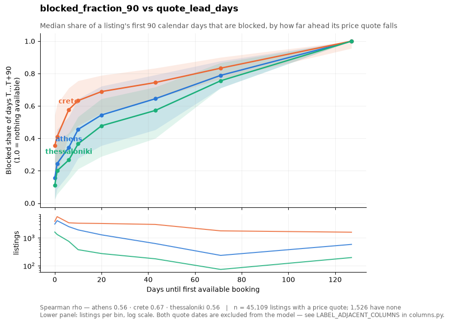

The correlation between the target and this column runs 0.56–0.67, and **every listing quoted more
than 90 days out has a target of exactly 1.0**.

That column, its sibling `_checkout_date` and 14 others went on a blocklist, enforced by a test
that fails if any of them reach the model. The less obvious consequence is about price. Price
here is a *dated quote*, not a standing nightly rate, so it goes missing exactly when the listing is
unavailable, i.e. price missingness tracks the target. Price therefore has to be imputed when missing
rather than passed through as NaN, and a "has price" flag can never be a feature, because it would
be a disguised copy of the answer.

That was the first instance of a pattern that kept recurring: **the leaks that matter are not the
columns named after the target. They are the ones that encode it sideways.**

*Details in: [`01_data_inventory.ipynb`](../notebooks/01_data_inventory.ipynb) §4–§5.*

---

## 3. What counts as one search

A ranker orders listings *within* a search, so a search has to be defined before anything can be
measured. Here we define a search as a **city × neighbourhood × room type × party size** query.
That yields **393 searches**.

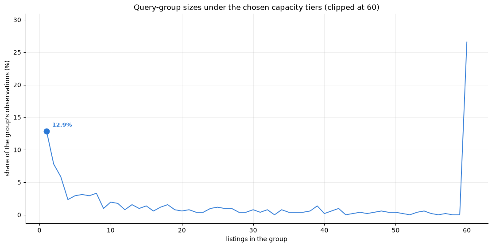

Some of those crossings hold too few listings to rank. Rather than deleting them or inventing a
pseudo-neighbourhood, thin groups fall down a two-rung ladder: first drop the neighbourhood, then
drop capacity. 99.4 % of listings never leave the full four-part key; only 289 of them do.

NDCG@10 is computed *inside* a search, so this definition decides what every number below means.

*Details in: [`03_feature_analysis.ipynb`](../notebooks/03_feature_analysis.ipynb) §1.*

---

## 4. Turning availability into a training target

The raw target is a fraction between 0 and 1. Ranking models want **grades**, discrete relevance
levels. Turning one into the other took two decisions, and both had a tempting answer that was
wrong.

### Which population does a listing get graded against?

The tempting answer: grade within `city × room type × price tier`, so that a grade means "in demand
*for what it costs*". It sounds sophisticated but it quietly corrupts the target.

A grade comes from ranking a listing against a peer group and cutting that ranking into levels, so
the grade depends on *who the listing was compared to*. If two listings compete in the same search
but were graded against *different* peer groups, the better listing can be handed the worse grade,
and the target then points the opposite way from the truth on the exact pairs the model is trained
to reproduce. `city × room type × price tier` does exactly that: a single search mixes price tiers,
so its listings are graded against different populations. A partition *coarser than* the search key
cannot, because everyone inside a search is then graded against the same peers.

The numbers make the choice. Across the 516 raw crossings behind those 393 searches, every
coarsening of the search key produces **zero** order inversions, while `city × room type ×
price tier` produces inversions in **163** of them.

So the partition is **`city × room type`**, and nothing derived from price ever touches the target.

### Where do the cuts fall?

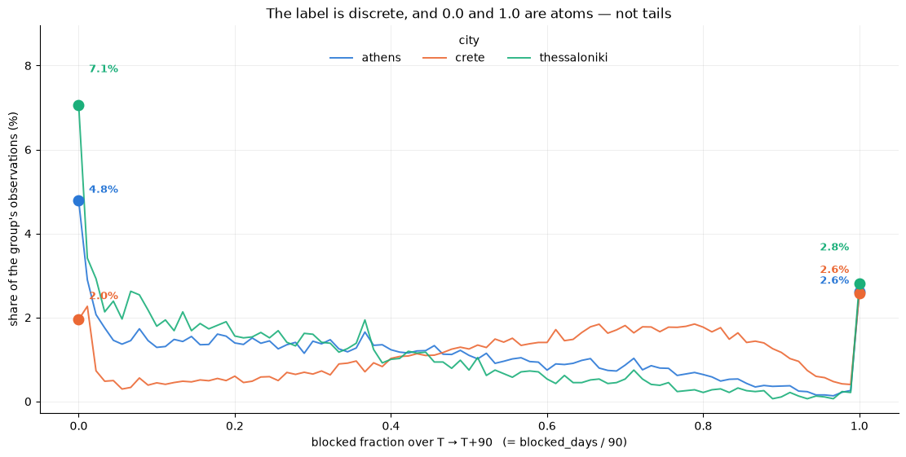

The second decision is where to cut the target's range into five grades, 0 to 4. The distribution
has two spikes, a pile at exactly 0.0 and another at exactly 1.0, with a continuum between. Plain
quintiles bury new listings: **38.6 %** of never-reviewed listings land in the bottom grade against
a 20 % base rate. That bias is written into the *training target itself*, before any feature or
model exists, and a model trained on it learns "new means irrelevant" from the labels alone.

The shipped scheme reserves grade 0 for the zero spike and quartiles everything above it into grades
1–4, cutting new-listing burial from 38.6 % to **8.0 %**.

One detail with a satisfying fix. The target lives on a 91-value grid (blocked days ÷ 90), so many
listings share exact values and quantile boundaries land mid-tie, where the split is decided by
*row order*, which is not a property of the listing at all. Cutting on the target's *value* rather
than its rank takes that from 5.8 % of listings to **0 %**. The cost is quartiles that are not
exactly 25 % each, but unequal bins describe the data better than an arbitrary tiebreak.

*Details in: [`02_label_validation.ipynb`](../notebooks/02_label_validation.ipynb) §2, §6.*

---

## 5. Validating the target before trusting it

Everything downstream inherits this target, so it was validated in full before any feature was
built. Four questions.

**Is it computed correctly?** Inside Airbnb ships their own `availability_90`, computed
independently. Ours reproduces it for **99.96–99.99 %** of listings. That does not prove the target
means anything, but it proves the window, the anchor and the counting are right, clearing a class of
objection before the harder questions.

**Does it point the right way?** If the target tracks demand, listings busy before T should be more
blocked after it. The instrument is reviews from the same season one year earlier: entirely
before T, so they cannot leak, and seasonally matched to the target window.

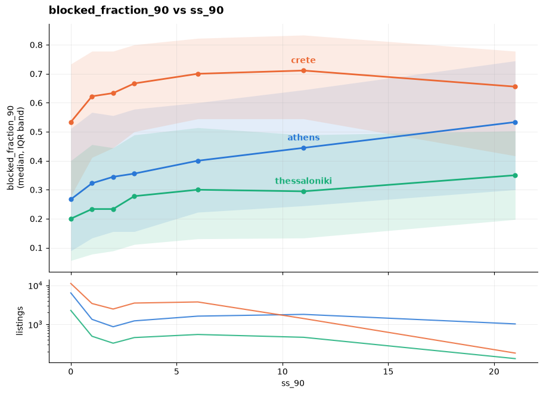

**All 54 combinations are positive**: 9 review signals × 3 cities × before and after filtering.
None negative. The rank correlations are modest, 0.10 to 0.31, and both halves deserve weight: a
weak correlation can be noise, but a weak correlation holding its sign across every signal, every
city and both populations is not.

**Where does the signal come from?** This is the finding. Split by listing age, the mean target
rises monotonically from never-reviewed to new-this-year to established, in all three cities.
Restrict to established listings and the correlation drops by a third to two-fifths, but does not
vanish and never flips sign. Then *within* the established cohort, ordering by rating (with a
≥ 10-review gate so the rating means something) gives a clean gradient correlation in every city.

> **The target is a two-stage signal.** Being established gets a listing into contention; review
> *quality* orders it within a cohort. It is *not* a measure of demand among
> otherwise-comparable listings.

That raises the obvious question: if it is establishment plus rating, why not rank on those two
attributes directly? Grouped into city × rating-band cells, they explain only about **18 %** of the
target's variance among established listings. The target carries availability information the
attributes do not, which is what a ranker is there to learn.

**Is anything better available?** This decides whether the confound is disqualifying. Inside
Airbnb's own occupancy estimate, the obvious substitute, correlates **0.76–0.81** with raw review
counts. It is a review model in disguise, and training on it would mean reproducing someone else's
model, circular with the review signals used to validate it. This target correlates **0.18–0.31**,
the lowest of every candidate: the confound is real, and it is the smallest one available.

### Four filter rules, and one that needed cross-examination

Four rules remove 1,951 of 46,635 listings (4.2 %): inactive listings, long-term rentals
(`minimum_nights > 30`), extreme prices (data errors above 20× their stratum median), and
**dormant** listings, blocked for ≥ 99 % of their *entire* forward calendar.

The last one reads the calendar, and removing them *raises* every correlation above, so both the
pre- and post-filter numbers are reported, and the reader can see that correlations rise by up to
0.10.

The rule earns its place on independent evidence. The 1,503 dormant listings carry the same *depth*
of review history as the fully-blocked listings kept (median 9 reviews in both), but their last
review sits a median of **546 days** before T and they offer at most 3 bookable nights across
their whole forward year. That is a clear sign of withdrawn stock. The listings kept at the same
fully-blocked target reopen for a median of **175 nights** later in the year, which is what a
booked-out summer property looks like.

One near-miss. The first version measured dormancy only *outside* the target window, to keep it
independent, and flagged 1,597 listings that were **actively selling during the window**, the
signature of a summer-seasonal operator and the core population of a Greek market. A seasonal
listing is open in summer by definition, so only a whole-year rule avoids mistaking one for dead
stock.

*Details in: [`02_label_validation.ipynb`](../notebooks/02_label_validation.ipynb) §1–§5.*

---

## 6. Features, and the ones left out

The model reads 61 features: size and capacity, price relative to the neighbourhood, review counts
and scores, host portfolio, 19 categories of amenity, and geography. Three things came up while
building them.

**A feature that is constant within a search can separate nothing.** A pairwise ranker learns from
differences *inside* a group, so a feature that does not vary inside a group contributes nothing to
any pair, however strongly it correlates with the target overall, and however high it climbs in an
importance chart. Measured as within-group variance against overall variance, roughly **a third of
the numeric block is near-constant inside a search**. Neighbourhood aggregates are the clearest
case: the neighbourhood is *in* the search key, so a neighbourhood average cannot vary within a
group. Same for geography and capacity. The strongest discriminators are the six Airbnb review
sub-scores, which vary *more* within a group than across the population. The ablations in §9
agree.

**Leave-one-out does not make a target aggregate safe.** The obvious neighbourhood feature is
"average target of my neighbours", computed leave-one-out, the standard guard against
self-inclusion. Inside a query group the sum is fixed, so the leave-one-out mean is a strictly
decreasing function of a listing's own target: **Spearman is exactly −1 in 100 % of the groups
scored**. A perfectly inverted answer key. Leave-one-out did not reduce that leak; it created it.

**Two features that were planned and dropped.**

- **Review sentiment.** A multilingual model was run locally over a sample and scored. Within
  searches it adds +0.015 over the rating. Among listings at the rating ceiling, the case that
  would have justified it by de-compressing the pile of five-star ratings, it correlates **−0.026**
  with the target, pointing the wrong way. Airbnb's own `review_scores_value`, already in the raw
  data, beats it **2.6×** and is free.
- **Imputing `bedrooms`.** Listings missing `bedrooms` sit at a within-group target percentile of
  0.498 against 0.505 for those that have it. The missingness carries no signal.

Each lost to about twenty minutes of measurement before any code was written.

One smaller thing worth keeping: a raw rating treats "5.0 from one guest" and "4.9 from four
hundred" as the same claim, so it was replaced with a **shrunk rating** that pulls thinly-evidenced
ratings toward the city average in proportion to how thin the evidence is. A new listing then enters
ranking with a defensible prior instead of a number built from a single review.

*Details in: [`03_feature_analysis.ipynb`](../notebooks/03_feature_analysis.ipynb) §2, §6, §7, §9.*

---

## 7. Train-test splitting and baselines

The ranker is a LambdaMART model, gradient-boosted trees trained with LightGBM to order listings
inside a query group. It is the system's **one learned stage**: candidate generation is a filter,
the query-group key plus a geographic policy, not a second learned model.

**The baselines were frozen before any model was trained**: rank by review count (0.6424) and
rank by good rating and low price (0.6218), against a random shuffle at 0.5414, all three
measured over the whole population. Freezing first matters because the target is substantially
establishment-driven, so "rank by review count" was expected to be strong. It is, over the
population. On the sealed fold the two baselines swap order, which is a useful reminder of how much
a single test half can move.

**The split had two constraints that conflicted.** Near-twin listings, meaning same host, location
and capacity, must not straddle the split, or the model memorises one twin and is scored on the
other. Searches must not be broken either, or the metric on the test half is computed over a partial
candidate set and is no longer what the baselines measured. But 76 clusters of twins span more than
one search, so neither constraint holds alone. The split therefore runs on the **connected
components** of the twin × search bipartite graph, the coarsest units that respect both exactly.

**The protocol is one sealed fold plus a four-fold development pool.** Query groups are split five
ways; every decision in this report was made against the development folds, and the sealed fold was
read exactly twice.

*Details in: [`04_evaluation.ipynb`](../notebooks/04_evaluation.ipynb) §1–§3.*

---

## 8. How it scores

The LambdaMART model scored **0.7530** [0.7148, 0.7903] NDCG@10 on the sealed fold, against 0.6429
for price+rating and 0.6390 for review count, on a floor of 0.5519. Paired search by search against
review count: **+0.1139 [0.0795, 0.1534]**.

A second, independent estimate on the 311 *different* searches of the development pool lands at
**0.7209** (+0.0776 [0.0594, 0.0938]). **The two agreeing matters more than either number.**

Per city, from that estimate: Athens 0.7347, Thessaloniki 0.7273, Crete 0.7030. The model leads in
all three, and every confidence interval clears zero. No per-city claim survives from the *sealed*
fold, which holds only four Thessaloniki searches.

### What one search actually looks like

A local console searches on the same four fields a search is built from and joins each response back
to the held-out grades.

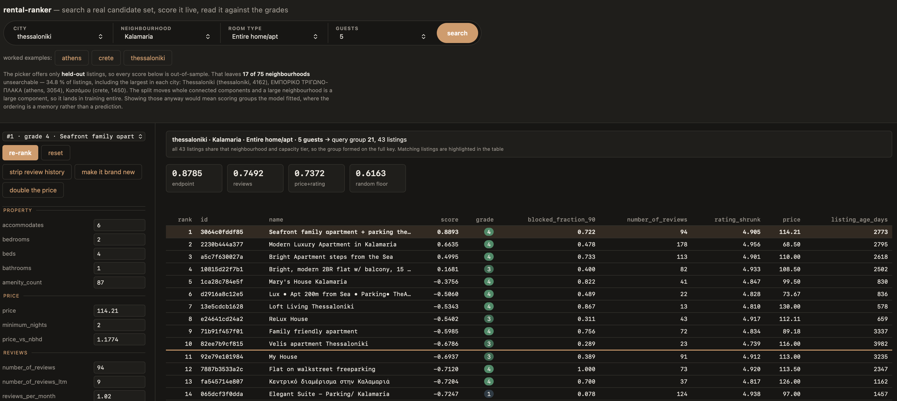

Thessaloniki / Kalamaria / 5 guests, 43 listings: 0.8785 against a 0.6163 floor, top three all
grade 4.

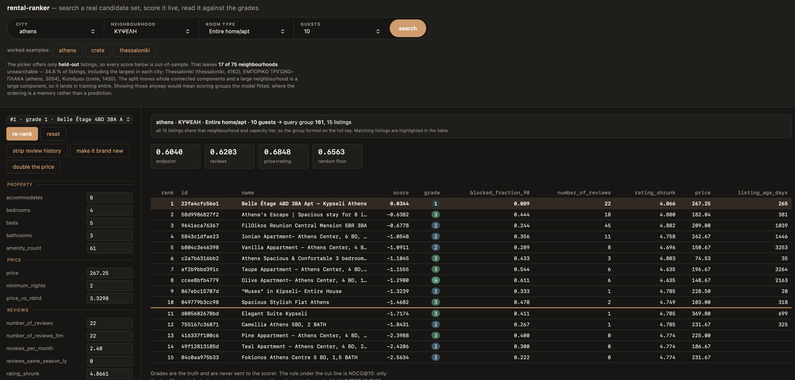

Athens / Kypseli / 10 guests, 15 listings: 0.6040 against a 0.6563 floor, beaten by both
baselines and by chance.

The loss is the more informative one. That Athens search is fifteen listings, thirteen of them
graded 2 or 3, with exactly one grade 4 to find. With a cut at ten, two-thirds of the group reaches
the top ten under *any* ordering, so ideal and random sit close together and the whole spread between
the best and worst possible ranker is **0.08**. The model is not really failing there; it is being
measured on a search with almost nothing to order.

*Details in: [`04_evaluation.ipynb`](../notebooks/04_evaluation.ipynb) §5, §10.*

---

## 9. Five checks before trusting the result

**Is it leakage?** The grades were shuffled *within* each search, leaving features and group
structure untouched, and the model was retrained and scored on them. The permuted models collapsed
to the random floor, while the real-label control at identical settings scored 0.7541. This is a
stronger check than the blocklist, because it also rules out the leakage paths nobody thought to
blocklist.

**Is it just re-deriving "old listings do well"?** A model deprived of all eight establishment
features still reached **0.7031**, and a model given only those eight reached **0.6660**, against
the full model's 0.7209.

**Is it tuned?** No. A 35-configuration search over the four development folds promised **+0.0142**
out of fold and delivered **−0.0016** on the sealed data, a textbook winner's curse, so the
default-parameter model shipped.

**Is it a lucky test set?** Because the split moves whole components together and a large
neighbourhood *is* a large component, 17 of 75 neighbourhoods have no listings in the sealed fold.
Groups from absent neighbourhoods were therefore compared against the rest *inside a single
out-of-fold estimate*: **−0.0075 [−0.0444, +0.0304]**. No detectable bias, and the interval is tight
enough to rule out a gap above about 0.04.

**Is it stable?** Across seeds the standard deviation is 0.0036 overall. In Thessaloniki it is
0.0395 across its four sealed searches, eleven times the overall figure, with three of five seeds
landing *below* the random floor.

### It reproduces on the cloud

The same protocol ran as an Azure ML command job against a pinned, versioned data asset.

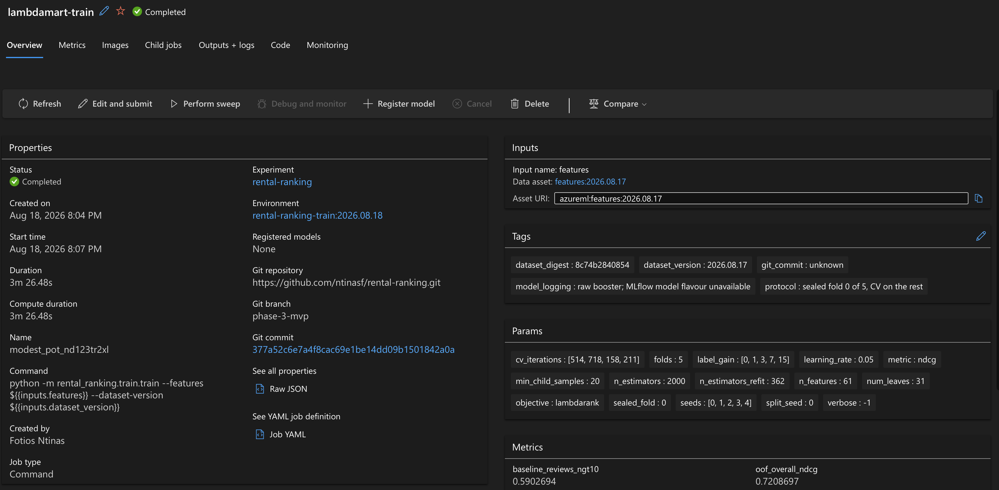

The tags carry the dataset version and digest and the protocol itself
(`sealed fold 0 of 5, CV on the rest`), and the logged `oof_overall_ndcg` is 0.7208697, the same
0.7209 quoted in §8. Preprocessing also runs as a two-step pipeline job, and the feature table it
built is **byte-identical** to the local one by SHA-256.

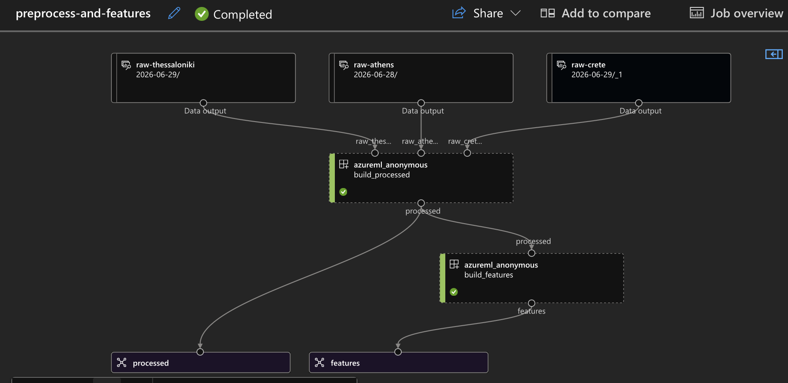

The model was then deployed to a managed online endpoint, invoked, captured and deleted in one
session. Endpoint and local booster return **bit-identical** floats.

**This demonstrates the workflow, not production behaviour.** Nothing in this repository tests how
this model would perform as a live product.

*Details in: [`04_evaluation.ipynb`](../notebooks/04_evaluation.ipynb) §4, §6, §7, §9, §11.*

---

## 10. Where it fails

### It buries good new listings, worse than chance

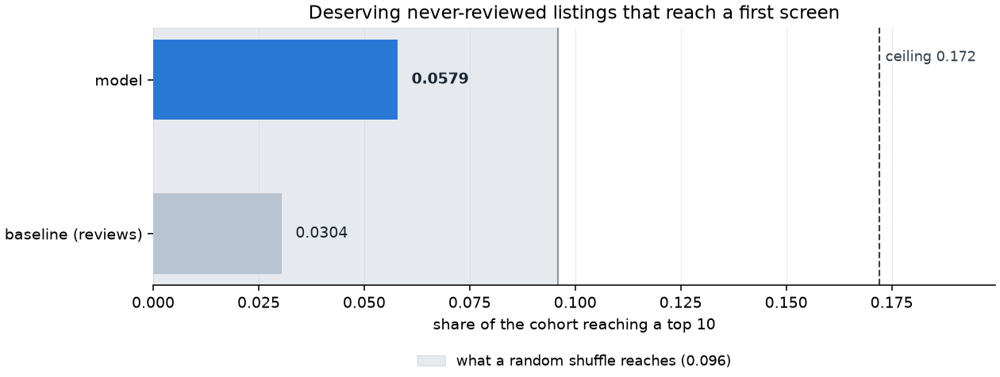

Of the 1,709 never-reviewed listings that the target itself grades 3 or above, the model
surfaces **5.8 %** into a top ten. A random shuffle would surface **9.6 %**. The review-count
baseline is worse still at 3.0 %, and the ceiling is 17.2 %.

The model is not confused about them. Within the cohort it still orders new listings against each
other sensibly, and about two-thirds of its discriminative ability survives. What it does is apply a
large penalty to the whole cohort, because **13 of 61 features carry no information at all for a
never-reviewed listing**, and those 13 hold 37.6 % of the model's total gain. The penalty is also
*correct on average*: 48.4 % of never-reviewed listings really are graded in the bottom two grades.
The model is doing exactly the pairwise-optimal thing it was trained to do.

So the fix is not feature engineering. It is a product decision about whether to apply the cohort
average at all, an exploration-versus-exploitation call.

**And the headline metric cannot see any of it.** In the searches with the *most* new listings the
model scores 0.7649 and beats the baseline by +0.0882, its best showing anywhere. NDCG's gain is
dominated by the top slots, which the model fills with established listings that genuinely are
high-grade. The score *improves* precisely where the cohort is buried.

### The same blind spot, tested on host scale

**NDCG@10 asks whether the top ten are good; it never asks *who* is in them.** A cohort can be
displaced from the first screen by listings that are just as good, and the metric registers nothing.

So the same test ran on **host scale**, small hosts against large operators, where there was no
prior expectation either way. Each comparison is paired inside a single search, holding
neighbourhood, room type and party size fixed.

Listings from large operators (≥ 5 listings) sit **0.113 of a group lower than their grades
warrant**, about 17 places in a group of 150, reaching the first screen 20.5 % of the time where
their grades earn them 24.9 %.

The effect is robust: the confidence interval excludes zero, and the direction holds in 79 % of
searches taken individually, so it is not a few extreme groups moving an average. It also survives
every "large operator" cutoff from 2 to 50 listings. Drop the cutoff entirely and band hosts by raw
portfolio size, and it scales cleanly, from +0.063 for single-listing hosts to −0.112 for hosts
running 25 to 99. Both figures are displacements in the same unit as the 0.113 above, a fraction
of a group's length, and a positive one means the band sits *higher* than its grades warrant.

Then the question that decides whether this is a defect or a blind spot: **does correcting it
improve the ranking?** An offset was added to large operators' scores and tuned on held-out folds,
so the fix is never judged on the data it was fit to. The best offset came out **zero, on all four
folds independently**: moving large operators up makes the ranking worse. The displacement is
roughly uniform across the whole search, while NDCG@10 sees only the top ten of searches averaging
150, so promoting the cohort promotes its many low-grade listings too, and in the top ten that costs
more than the good ones gain.

To be clear about what this is and is not: the disparity runs *toward* single-listing hosts, which
few people would call an injustice, and none of it is an accusation against the model. The finding
is the **blind spot**, not the cohort. Anything worth knowing about who reaches the first screen
has to be measured on purpose, because the headline number will read the same either way.

*Details in: [`04_evaluation.ipynb`](../notebooks/04_evaluation.ipynb) §8, §8.1.*

---

## 11. The experiment we designed and did not run

Everything above is offline. The honest answer to "how would you know this works in a product" is an
experiment, and [`docs/ab_test_design.md`](ab_test_design.md) is that experiment, specified in full
and **not run**.

**The question is real.** A guest searching a whole city rather than a neighbourhood hands the
ranker a candidate set an order of magnitude larger, and the ranker holds no signal about *where*
they want to stay. Should the system narrow to a
few system-chosen neighbourhoods before ranking, or rank the whole city?

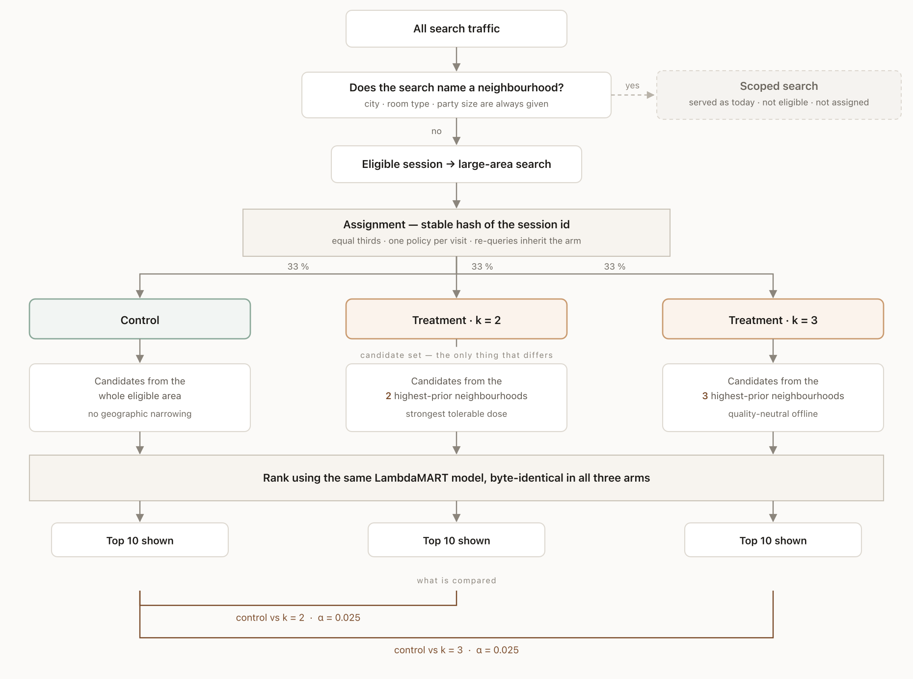

Two doses, *k* = 2 and *k* = 3, so a null at one variant cannot be mistaken for a null on the idea. The
candidate set is the only thing that differs between the arms, which is what makes any measured
effect attributable to the narrowing policy rather than to the model.

**Offline work settles the cost and cannot touch the benefit.**

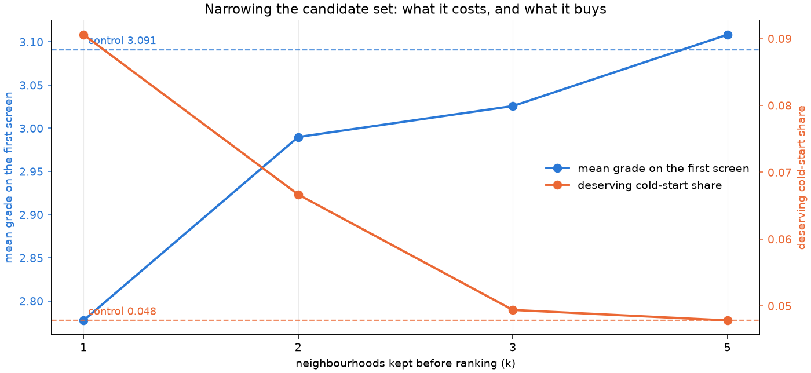

At *k* = 5 narrowing is quality-neutral and therefore pointless; at *k* = 1 it costs a third of a
grade point and eleven points of first-screen relevant share. The two useful doses sit between. But
both of those curves price the *cost* of narrowing, and neither can price its benefit, because the
benefit is that the kept neighbourhoods are the ones the guest wanted, and **no offline dataset
contains a guest's destination preference**. The simulation locates the trade-off and rules out the
extremes; only live traffic can say whether the exchange is worth making.

**A registered prediction that runs against expectation.** Narrowing nearly *doubles* deserving
cold-start exposure at small *k*, 0.048 → 0.067 at *k* = 2 and gone again by *k* = 3, because a good
new listing competes against one neighbourhood instead of an entire city's established inventory. So
H₂ predicts a rise in one arm and *none* in the other, on the same traffic in the same window,
which is a sharper test than either prediction alone. It is §10 seen from the other side: reach
relative to chance degrades 0.57 → 0.54 → 0.22 as the candidate set widens, so an unnarrowed
city-wide ranking buries deserving new listings roughly **five times worse than chance**.

**Three things the design states rather than designs away.** *Interference*: listings are shared
inventory, so a treatment guest booking one removes it from what a control guest could book,
violating SUTVA in a way session-level randomisation cannot fix. The bias runs **away from the
null** and scales with the true effect, which is what keeps a tight null interpretable.
*Comparability*: the control arm ranks a set spanning several neighbourhoods, which only makes sense
if a score means the same thing in each. This project asserted the opposite for a month, then
measured it at **−0.0016 [−0.0122, +0.0092]** over 54 cells, indistinguishable, and bounded to one
city and room type. *Traffic*: the booking-intent baseline and eligible sessions per day are not
observable here, so duration is published as a lookup (4 weeks at 20,000 eligible sessions a day,
7.3 weeks at 11,000) rather than one number that would look more certain than it is.

**Two guardrails are ship-blocking**, both invisible in every guest-side metric and both compounding
over time: **neighbourhood exposure coverage**, because a demand prior can starve low-prior
neighbourhoods entirely and starved inventory generates no demand signal for the next window; and
**cold-start exposure**, because a buried listing earns no reviews and stays buried.

**No experiment was run.** No live product, no traffic, no behavioural data.

*Full design, with sample sizes, decision rules and the instrumentation it would need:
[`docs/ab_test_design.md`](ab_test_design.md).*

---

## 12. Limitations

1. **The target is availability, not demand** (§1). A ceiling no modelling choice moves.
2. **The grades are constructed, not judged by people.** Quartiles of the target, not human
   relevance ratings, which puts this closer to a dressed-up rank correlation than to the NDCG in a
   learning-to-rank paper. Do not benchmark 0.753 against published numbers.
3. **It buries good new listings**, worse than chance, and the headline metric is blind to it (§10).
4. **There is no guest data.** No dates, no party history, no previous searches. The "search" is a
   market segment, and the model emits one fixed order per segment.
5. **The split is structural, not across time.** Nothing tests "train on an earlier snapshot, rank a
   later one", which is what deployment requires.
6. **393 searches is a small effective sample**, and the headline rests on 72 of them. The overall
   effect survives that; no per-city claim from the sealed fold does.
7. **The test set does not cover geography evenly.** The gap it leaves is measured in §9 and shows
   no detectable bias, but it narrows what the sealed fold can speak to.
8. **Nothing here is causal.** The model orders listings by a demand proxy. It does not identify
   what *causes* a listing to do well.

---

*Data from [Inside Airbnb](https://insideairbnb.com/), licensed
[CC BY 4.0](https://creativecommons.org/licenses/by/4.0/). Host and reviewer identifying information
is stripped or hashed before anything is written to disk.*
