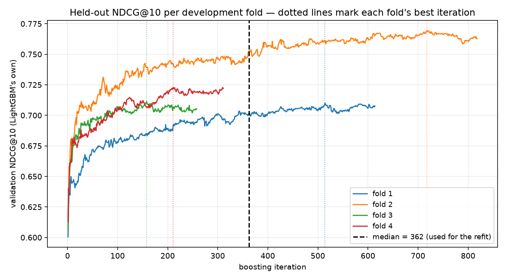

# Ranking short-term rental listings

**A search ranking system built on public Inside Airbnb data for Athens, Thessaloniki and
Crete — 44,684 listings — trained locally and deployed on Azure ML.**

When someone searches for a place to stay, hundreds of listings match. Something has to decide
which ten appear first. This is a build of that something: the target, the features, the model,
the evaluation, and — the part that took the most work — a careful account of what the result does
and does not mean.

---

## The result, up front

On a sealed fifth of the data, opened exactly twice and now closed:

| ranker | NDCG@10 | |
|---|---|---|
| **this model** | **0.7530** | 95 % interval [0.7148, 0.7903] |
| rank by good rating and low price | 0.6429 | frozen before the model existed |
| rank by number of reviews | 0.6390 | frozen before the model existed |
| **random shuffle** | **0.5519** | the floor |

Read the floor first. NDCG normalises against the best possible ordering *within* each search, so
with ten slots and a decent share of good listings even a shuffle gets a lot right. **The usable
range is 0.55 → 1.00, not 0 → 1.** The model crosses 44.9 % of it; the best simple rule crosses
19.4 %.

Now the catch that governs everything below. **The target is forward calendar availability, not
demand.** And the model **buries good new listings worse than chance** — a failure the headline
metric is structurally unable to see. Both are measured, not hedged, in §10.

Getting to a number took a week. Getting to a number worth trusting took the rest, and most of this
report is the difference.

---

## 1. Nobody publishes what guests chose

A ranking model needs two things: items to order, and a signal saying which order is right. Inside
Airbnb publishes listing attributes for whole cities, so the first is easy. The second is the
entire problem.

There are no clicks, no bookings, no search logs. What *is* public is each listing's **calendar**:
for every night over the next year, whether it is open or blocked. So the target is **the fraction
of the next 90 nights that are blocked** — fully blocked scores 1.0, everything open scores 0.0.

**A blocked night is not necessarily a booked night.** The host might be visiting family, doing
repairs, or have pulled the place off the market for the season, and the data cannot tell those
apart from a booking. The target is a **demand proxy**, is called that everywhere in this project,
and no modelling choice fixes it. It is the ceiling on the whole build.

Two design choices follow:

- **The window points forward, into July–September.** Peak season is when "blocked ≈ booked" is
  most believable. In February a blocked night says much less.
- **The window is anchored per listing**, at that listing's own first calendar day (**T**), not at
  one date per city. Only 3.4 % of Athens listings were scraped on the day the snapshot folder is
  named after, so a fixed city date would have been wrong for most of the market.

*Detail: [`01_data_inventory.ipynb`](../notebooks/01_data_inventory.ipynb) §1–§3.*

---

## 2. One column that gave away the answer

A column called `price_quote_checkin_date` looks like harmless scraping metadata: the check-in date
used when a price was fetched. It is not. The scraper walks forward through the calendar until a
quote succeeds, so that date **is the listing's first bookable day** — a direct read of the
availability the target measures.

The correlation runs 0.56–0.67, and **every listing quoted more than 90 days out has a target of
exactly 1.0**.

That column, its sibling `_checkout_date` and 14 others went on a blocklist, enforced by a test
that fails if any of them reach the model. The less obvious consequence is about **price**. Price
here is a *dated quote*, not a standing nightly rate, so it is missing exactly when the listing is
unavailable — price missingness tracks the target. Price therefore has to be imputed rather than
passed through as NaN, and a "has price" flag can never be a feature, because it would be a
disguised copy of the answer.

That was the first instance of a pattern that kept recurring: **the leaks that matter are not the
columns named after the target. They are the ones that encode it sideways.**

*Detail: [`01_data_inventory.ipynb`](../notebooks/01_data_inventory.ipynb) §4–§5.*

---

## 3. What counts as one search

A ranker orders listings *within* a search, so a search has to be defined before anything can be
measured. One search here is **city × neighbourhood × room type × party size** — the four things a
guest fixes before looking at results. That yields **393 searches**.

Some crossings are too thin to rank. Rather than deleting them or inventing a pseudo-neighbourhood,
thin groups fall down a two-rung ladder: drop the neighbourhood, then drop capacity. **99.4 % of
listings never leave the full four-part key**; the 289 that do are counted rather than hidden.

The metric is computed *inside* a search, so this definition decides what every number below means.

*Detail: [`03_feature_analysis.ipynb`](../notebooks/03_feature_analysis.ipynb) §1.*

---

## 4. Turning availability into a training target

The raw target is a fraction between 0 and 1. Ranking models want **grades** — discrete relevance
levels. Two decisions had to be made, and both had a tempting answer that was wrong.

### Which population does a listing get graded against?

The tempting answer: grade within `city × room type × price tier`, so a grade means "in demand *for
what it costs*". It sounds more sophisticated. It is broken.

If the grading partition is a **coarsening** of the search key — every search sitting inside one
grading cell — then within any search the grade is a step function of the target, and a higher
target can never receive a lower grade. If the partition **cross-cuts** the key, listings competing
in the same search were quantiled against different populations and their grade order can *oppose*
their target order.

Measured across all 516 raw groups: every coarsening produces **zero** inversions.
`city × room type × price tier` inverts in **163 groups holding 89 % of the population** — each one
handing some listing with lower forward demand a higher relevance grade than a competitor it is
ranked directly against, on the very pairs the model is trained to reproduce.

So the partition is **`city × room type`**, and nothing derived from price touches the target at any
point. The rule, stated once: **a grading partition must be a coarsening of the search key, never a
cross-cut of it.**

### Where do the cuts fall?

The target has two spikes — a pile at exactly 0.0 and another at exactly 1.0 — with a continuum
between. Plain quintiles bury new listings: **38.6 %** of never-reviewed listings land in the bottom
grade against a 20 % base rate. That is a bias written into the *training target itself*, before any
feature or model exists, and a model trained on it learns "new means irrelevant" from the labels
alone.

The shipped scheme reserves grade 0 for the zero spike and quartiles everything above it into grades
1–4, cutting new-listing burial from 38.6 % to **8.0 %**. A control scheme shows where the benefit
comes from: reserve the *top* spike instead and pool the zeros, and burial gets *worse* than doing
nothing (43.9 %). The bottom grade is the lever; the top one is not.

One detail with a satisfying fix. The target lives on a 91-value grid (blocked days ÷ 90), so many
listings share exact values and quantile boundaries land mid-tie — where the split is decided by
**row order**, which is not a property of the listing at all. Cutting on the target's *value* rather
than its rank takes that from 5.8 % of listings to **0 %**. The cost is quartiles that are not
exactly 25 % each, which is the better trade: an unequal bin describes the data, an arbitrary
tiebreak is noise.

*Detail: [`02_label_validation.ipynb`](../notebooks/02_label_validation.ipynb) §2, §6.*

---

## 5. Validating the target before trusting it

Everything downstream inherits this target and nothing downstream can rescue it, so it got a full
pass before any feature was built. Four questions.

**Is it computed correctly?** Inside Airbnb ships their own `availability_90`, computed
independently. Ours reproduces it for **99.96–99.99 %** of listings. That does not prove the target
means anything — it proves the window, the anchor and the counting are right, clearing a class of
objection before the harder questions.

**Does it point the right way?** If the target tracks demand, listings busy before T should be more
blocked after it. The instrument is reviews from **the same season one year earlier** — entirely
before T, so it cannot leak, and seasonally matched to the target window.

**All 54 combinations are positive** — 9 review signals × 3 cities × before and after filtering.
None negative. The correlations are modest, 0.10 to 0.31, and both halves deserve weight: a weak
correlation can be noise, but a weak correlation holding its sign across every signal, every city
and both populations is not. The interquartile bands are the caveat — review history shifts the
*centre* of a listing's availability and explains little of the spread.

**Where does the signal come from?** This is the finding. Split by listing age, the mean target
rises monotonically from never-reviewed to new-this-year to established, in all three cities.
Restrict to established listings and the correlation drops by a third to two-fifths, but does not
vanish and never flips sign. Then *within* the established cohort, ordering by rating (with a
≥ 10-review gate so the rating means something) gives a clean gradient in every city.

> **The target is a two-stage signal.** Being established gets a listing into contention; review
> *quality* orders it within that cohort. It is **not** a measure of demand among
> otherwise-comparable listings.

**Is anything better available?** This decides whether the confound is disqualifying. Inside
Airbnb's own occupancy estimate — the obvious substitute — correlates **0.76–0.81** with raw review
counts. It is a review model in disguise, and training on it would mean reproducing someone else's
model, circular with the review signals used to validate it. Our target correlates **0.18–0.31**,
the lowest of every candidate: the confound is real, and it is the smallest one on offer.

And against the obvious rebuttal — *if it is establishment plus rating, why not rank on those?* —
grouped into city × rating-band cells those two attributes explain only about **18 %** of the
target's variance among established listings. The target carries availability information the
attributes do not, which is what a ranker is supposed to learn.

### Four filter rules, and one that needed cross-examination

Four rules remove 1,951 of 46,635 listings (4.2 %): inactive listings, long-term rentals
(`minimum_nights > 30`), extreme prices (data errors above 20× their stratum median), and
**dormant** listings, blocked for ≥ 99 % of their *entire* forward calendar.

The last one reads the calendar, and removing its catch *raises* every correlation above — so both
the pre- and post-filter numbers are reported, and the reader can see that rho rises by up to 0.10.

The rule earns its place on independent evidence. The 1,503 dormant listings carry the same *depth*
of review history as the fully-blocked listings kept (median 9 reviews in both), but their last
review sits a median of **546 days** before T and they offer at most **3 bookable nights** across
their whole forward year. That is withdrawn stock. The listings kept at the same fully-blocked
target reopen for a median of **175 nights** later in the year — what a booked-out summer property
looks like and a dead one does not. Reviews live in a separate source file the rule never touches.

One near-miss. The first version measured dormancy only *outside* the target window, to keep it
independent, and flagged 1,597 listings **actively selling during the window** — summer-seasonal
operators, the core population of a Greek market. A seasonal listing is open in summer by
definition, so only a whole-year rule avoids mistaking one for dead stock. There is now a test named
for that mistake.

*Detail: [`02_label_validation.ipynb`](../notebooks/02_label_validation.ipynb) §1–§5.*

---

## 6. Features, and the ones we left out

The model reads 61 features: size and capacity, price relative to the neighbourhood, review counts
and scores, host portfolio, 19 categories of amenity, and geography. Three things learned building
them are worth more than the list.

**A feature that is constant within a search can separate nothing.** A pairwise ranker learns from
differences *inside* a group, so a feature that does not vary inside a group contributes nothing to
any pair — however strongly it correlates with the target overall, and however high it climbs in an
importance chart. Measured as within-group variance against overall variance, roughly **a third of
the numeric block is near-constant inside a search**. Neighbourhood aggregates are the clearest
case: the neighbourhood is *in* the search key, so a neighbourhood average cannot vary within a
group. Same for geography and capacity. They still *condition* — a tree that knows it is in central
Athens reads `price` differently than in rural Crete — but they do not discriminate. The strongest
discriminators are the six Airbnb review sub-scores, which vary **more** within a group than across
the population. The ablations in §9 agreed.

**Leave-one-out does not make a target aggregate safe.** The obvious neighbourhood feature is
"average target of my neighbours" computed leave-one-out, the standard guard against self-inclusion.
It is not safe here, and the reason is arithmetic: 365 of 393 searches sit entirely inside one
neighbourhood, and within such a group the leave-one-out mean is `(S − yᵢ)/(n − 1)` where `S` and
`n` are *the same constants for every row*. The feature is an exactly decreasing function of each
listing's own target — **Spearman is exactly −1.000 in 100 % of the groups scored**. A perfectly
inverted answer key, handed to a model that only ever compares within a group.

Leave-one-out did not reduce that leak. It **created** it: including the listing would have added a
constant term partially masking the inversion. The lesson is to never aggregate the target over a
unit that nests inside the unit you rank within. Where it *is* appropriate — the price aggregates —
it moves the number by **€0.11** on a median price of about €120: correct, worth doing, and a useful
reminder that the rule bites hardest where the denominator is small.

**Three features we meant to build and did not.**

- **Review sentiment.** A multilingual model was run locally over a sample and scored. Within
  searches it adds **+0.015** over the rating. Among listings at the rating ceiling — the case that
  would have justified it, de-compressing the pile of 5.0s — it correlates **−0.026** with the
  target, pointing the wrong way. Airbnb's own `review_scores_value`, already in the raw data and
  initially missed, beats it **2.6×** and is free.
- **Imputing `bedrooms`.** Listings missing `bedrooms` sit at a within-group target percentile of
  0.498 against 0.505 for those that have it. The missingness carries no signal, so imputing would
  manufacture a value where the model can currently learn "absent" as its own branch.
- **A neighbourhood target aggregate.** Removed for the reason above.

Each lost to about twenty minutes of measurement before any code was written.

One smaller thing worth keeping: raw rating treats "5.0 from one guest" and "4.9 from four hundred"
as the same claim. It is replaced with a shrunk rating that pulls thinly-evidenced ratings toward
the city average in proportion to how thin the evidence is, so new listings enter ranking with a
*defined* rating rather than a NaN while a separate flag still marks them.

*Detail: [`03_feature_analysis.ipynb`](../notebooks/03_feature_analysis.ipynb) §2, §6, §7, §9.*

---

## 7. The protocol, and why it looks paranoid

**The baselines were frozen before any model was trained**: rank by review count (**0.6424**), and
rank by good rating and low price (**0.6218**), against a random shuffle at **0.5424**. Freezing
first matters because the target is substantially establishment-driven, so "rank by review count"
was expected to be strong. The worry was never that the model would fail — it was that it might
succeed by being an elaborate establishment ranker with nobody checking.

**The split had two constraints that conflicted.** Near-twin listings — same host, location and
capacity — must not straddle the split, or the model memorises one twin and is scored on the other.
Searches must not be broken either, or the metric on the test half is computed over a partial
candidate set and is no longer what the baselines measured. But 76 clusters of twins span more than
one search, so neither constraint holds alone. The fix: split on the **connected components** of the
twin × search graph, the coarsest units respecting both exactly. It cost almost nothing — 345
components, none crossing a city — so both constraints hold, no listing is dropped, no search is
broken.

**One test set was not enough.** Baseline A minus baseline B is a **constant**: neither is fitted,
neither reads the target. Read off each of five folds in turn as if it were the test set, that
constant reads anywhere from **0.005 to 0.049**, against a true value of 0.0207. A single ~75-group
test set therefore carries uncertainty about the size of the effect the whole project exists to
detect. So the protocol became **one sealed fold plus a four-fold development pool**: every decision
is made against ~307 groups, and the sealed fold stays sealed.

**It was read exactly twice**, both times declared in advance, and it is now closed. That is what
keeps it a held-out score rather than a number quietly optimised against.

*Detail: [`04_evaluation.ipynb`](../notebooks/04_evaluation.ipynb) §1–§3.*

---

## 8. The result

On the sealed fold — 72 searches the model never saw — NDCG@10 is **0.7530** [0.7148, 0.7903],
against 0.6429 for price+rating and 0.6390 for review count, on a floor of 0.5519. Compared search
by search against review count: **+0.1139 [0.0795, 0.1534]**.

A second, independent estimate on 311 *different* searches from the development pool lands at
**0.7209** (+0.0776 [0.0594, 0.0938]). **The two agreeing matters more than either number.**

Per city, from that estimate: Athens 0.7347, Thessaloniki 0.7273, Crete 0.7030 — the model leads in
all three, every interval clearing zero. No per-city claim survives from the *sealed* fold, which
holds only four Thessaloniki searches.

### What one search actually looks like

A local console searches on the same four fields a search is built from and joins each response back
to the held-out grades, so an ordering can be read against the truth.

Thessaloniki / Kalamaria / 5 guests, 43 listings: **0.8785** against a 0.6163 floor, top three all
grade 4.

Athens / Kypseli / 10 guests, 15 listings: **0.6040** against a **0.6563** floor — beaten by both
baselines and by chance.

The loss is the more informative one, and measurably so. That Athens search is fifteen listings of
which thirteen are graded 2 or 3, with exactly one grade 4 to find. With a cut at ten, two-thirds of
the group reaches the top ten under *any* ordering, so ideal and random sit close together and the
whole spread between the best and worst possible ranker is **0.08**. The model is not really failing
there; it is being measured on a search with almost nothing to order. **That is the argument for
reporting over 72 searches with an interval instead of quoting any single one.**

*Detail: [`04_evaluation.ipynb`](../notebooks/04_evaluation.ipynb) §5, §10.*

---

## 9. Five checks before believing it

**Is it leakage?** The grades were shuffled *within* each search — features untouched, group
structure preserved — and the model retrained and scored. The permuted models collapse to the random
floor while the real-label control at identical settings scores 0.754. This is stronger than the
blocklist check, which only proves no *named* target column is present; the permutation test also
rules out a path nobody thought to name. Probably the most important check here.

**Is it just re-deriving "old listings do well"?** Establishment features top the importance chart —
8 of 61 features carry 29.5 % of total gain — which on its own suggests the model is restating what
§5 already found. Gain importance cannot settle that, so restricted models were trained instead. A
model **denied all 8 establishment features still reaches 0.7031**; one **given only them reaches
0.6660**; the full model reaches 0.7209. Neither half explains the result.

That ablation does double duty. It is the only evidence bearing on a deeper worry: the target sits
**downstream of Airbnb's own ranker**, since a listing's calendar is blocked partly because Airbnb
ranked it well and sent it traffic. That cannot be separated from genuine demand with one public
snapshot and no search logs. But if the model were largely re-deriving exposure through tenure and
review count, removing those features should collapse it, and it does not. That bounds the concern
without eliminating it.

**Is it tuned?** No.

The curves flatten by about iteration 150 while the four folds' chosen stopping points scatter from
158 to 718 — a 4.5× spread over a 0.06 band. A 35-configuration search over a surface that flat
promised **+0.0142** out of fold and delivered **−0.0016** on the sealed data. That is the winner's
curse observed rather than argued: the winner's gain was the maximum of 34 draws, and the maximum of
noise is positive. The acceptance rule was written before the search ran, the reported model runs on
defaults, and the tuned result is reported beside it.

The search was not wasted — it identified *why* there was nothing to find. One parameter dominates,
`lambdarank_truncation_level`, which caps how far down a list a pair still generates training
signal; with searches up to 2,088 listings, truncating early discards almost every pair in the
groups carrying most of the signal. The default already sits near the plateau.

**Is it a lucky test set?** Because the split moves whole components and a large neighbourhood *is*
a large component, 17 of 75 neighbourhoods have no listings in the sealed fold. Rather than worrying
about it, groups from absent neighbourhoods were compared against the rest *inside a single
out-of-fold estimate*: **−0.0075 [−0.0444, +0.0304]**. No detectable bias, tight enough to rule out
a gap above ~0.04. The coverage gap narrows what the test set can speak to; it does not bend what it
says.

**Is it stable?** Across seeds, standard deviation 0.0036 overall — except in Thessaloniki, where it
is 0.0395 across its four sealed searches, eleven times the overall figure, with three of five seeds
landing *below* the random floor. Which is the conclusion the interval already gave.

### It reproduces outside this laptop

The same protocol ran as an Azure ML command job against a pinned, versioned data asset.

The tags carry the dataset version and digest and the protocol itself
(`sealed fold 0 of 5, CV on the rest`), and the logged `oof_overall_ndcg` is 0.7208697 — the same
0.7209 quoted in §8. Preprocessing also runs as a two-step pipeline job, and the feature table it
built is **byte-identical** to the local one by SHA-256.

The model was then deployed to a managed endpoint, invoked, captured and deleted in one session.
Endpoint and local booster return **bit-identical** floats — not "close". The session cost about
**$0.02**: fifteen minutes to provision, **29 seconds of use**, eight minutes to delete. Left
running it would be roughly $98/month.

**This demonstrates the workflow, not production behaviour.** Nothing in this repository tests how
the model would perform in a live product — not the endpoint, not the console, not any number
above. That is what §11 is for.

*Detail: [`04_evaluation.ipynb`](../notebooks/04_evaluation.ipynb) §4, §6, §7, §9, §11.*

---

## 10. Where it fails

Probably the most useful section here.

### It buries good new listings, worse than chance

Of the 1,709 never-reviewed listings that **the target itself grades 3 or above**, the model
surfaces **5.8 %** into a top ten. A random shuffle would surface **9.6 %**. The review-count
baseline is worse still at 3.0 %, and the ceiling is 17.2 %. Both bars sit inside the band a shuffle
would reach.

The model is not confused about them — within the cohort it still orders new listings against each
other sensibly, and about two-thirds of its discriminative ability survives. What it does is apply a
large penalty to the whole cohort, because **13 of 61 features carry no information at all for a
never-reviewed listing, and those 13 hold 37.6 % of total gain**. And the penalty is *correct on
average*: 48.4 % of never-reviewed listings really are graded in the bottom two grades. The model is
doing exactly the pairwise-optimal thing it was trained to do.

So the fix is not feature engineering. It is a product decision about whether to apply the cohort
average at all — an exploration boost, of the kind real marketplaces run.

**And the headline metric cannot see any of it.** In the searches with the *most* new listings the
model scores 0.7649 and beats the baseline by +0.0882, its best showing anywhere. NDCG's gain is
dominated by the top slots, which the model fills with established listings that genuinely are
high-grade. The score *improves* precisely where the cohort is buried.

### The same blindness, on a cohort where we did not know the answer

Cold start is one instance of something general: **NDCG asks whether the top ten are good; it never
asks who is in them.** If the listings that displace a cohort are equally good, the displacement is
free as far as the metric is concerned.

So the same test ran on **host scale** — small hosts against large commercial operators — where
there was no prior expectation either way. One choice makes the measurement mean what it says: the
reference is the **ideal ranking, not a shuffle**, because a cohort can reach the first screen less
often purely by being less in demand and a shuffle reference would blame the ranker for that. The
comparison is also paired inside each search, holding neighbourhood, room type and party size fixed.

Listings from large operators sit **0.113 of a group lower than their grades warrant** — about 17
places in a group of 150 — reaching a first screen 20.5 % of the time where their grades earn them
24.9 %. The interval excludes zero, the direction holds in 79 % of searches individually, it
survives every threshold from 2 to 50 listings, and it shows a clean dose response from +0.063 for
single-listing hosts to −0.112 at 25–99.

Then the question that decides whether this is a defect or a blind spot: **does correcting it
improve the ranking?** An offset was added to large operators' scores and tuned. The best offset is
**zero, chosen independently on all four folds** — moving them up makes the ranking worse. The
displacement is roughly uniform across the whole search, while NDCG@10 sees only the top ten of
searches averaging 150, so promoting the cohort promotes its many low-grade members too, and in the
top ten that costs more than the good ones gain.

To be clear about what this is and is not: the disparity runs *toward* single-listing hosts, which
few people would call an injustice, and this is not an accusation against the model. The finding is
the **blind spot**, not the cohort. The same machinery would have hidden the same disparity along an
axis where it did matter, and nothing in §8 would have said so.

*Detail: [`04_evaluation.ipynb`](../notebooks/04_evaluation.ipynb) §8, §8.1.*

---

## 11. The experiment we designed and did not run

Everything above is offline. The honest answer to "how would you know this works in a product" is an
experiment, and [`docs/ab_test_design.md`](ab_test_design.md) is that experiment, specified in full
and **not run**.

**The question is real.** A guest searching a whole city rather than a neighbourhood hands the
ranker a candidate set an order of magnitude larger, and the ranker holds no signal about *where*
they want to stay — no dates, no history, no destination preference. Should the system narrow to a
few system-chosen neighbourhoods before ranking, or rank the whole city? Two doses, *k* = 2 and
*k* = 3, so a null at one dose cannot be mistaken for a null on the idea.

**Offline work settled the cost side and cannot touch the benefit side.**

| *k* | mean grade on the first screen | share grade ≥ 3 | deserving cold-start share |
|---|---|---|---|
| control | 3.091 | 0.742 | 0.048 |
| 5 | 3.108 | 0.751 | 0.048 |
| 3 | 3.026 | 0.725 | 0.049 |
| 2 | 2.990 | 0.715 | **0.067** |
| 1 | 2.778 | 0.635 | **0.091** |

At *k* = 5 narrowing is quality-neutral and therefore pointless. At *k* = 1 it costs a third of a
grade point and eleven points of relevant share. The two useful doses sit between.

But every column there measures the **cost** of narrowing. None measures its benefit, because the
benefit is that the retained neighbourhoods are the ones the guest wanted, and **no offline dataset
contains a guest's destination preference**. The simulation locates the trade-off and rules out
*k* = 1 and *k* = 5; only a live test can say whether the exchange is worth making. That is the
whole reason this is a design and not a result.

**A registered prediction that runs against expectation.** Narrowing nearly *doubles* deserving
cold-start exposure at small *k* — 0.048 → 0.091 at *k* = 1, 0.067 at *k* = 2, gone by *k* = 3 —
because a good new listing in a chosen neighbourhood competes against that neighbourhood rather than
an entire city's established inventory. So H₂ predicts an increase in the *k* = 2 arm and **none** in
the *k* = 3 arm. Observing the increase in one and its absence in the other, on the same traffic in
the same window, is a sharper test than either prediction alone.

This is where §10 connects. Reach relative to chance degrades **0.57 → 0.54 → 0.22** as the candidate
set widens from a neighbourhood-scoped search to a city-wide one: an unnarrowed large-area ranking
buries deserving new listings roughly **five times worse than chance**.

**Interference is stated, not designed away.** Listings are shared inventory, so a treatment guest
booking one removes it from what a control guest can book — violating SUTVA in a way session-level
randomisation cannot fix. The consequence that matters: the bias inflates the estimate **away from
the null** and scales with the true effect, which is what keeps a tight null interpretable. The
switchback follow-up has a declared trigger rather than being a discretionary escape.

**One assumption we had backwards.** The control arm ranks a candidate set spanning several
neighbourhoods, which only makes sense if a score means the same thing in one neighbourhood as in
another — and this project asserted the opposite for a month, leaving the design quietly relying on
something its own record denied. Measured: pairwise ordering accuracy is **0.6447** across
neighbourhoods against **0.6433** within one, **−0.0016 [−0.0122, +0.0092]** over 54 cells.
Indistinguishable. Bounded to one city and room type, because grades are quartiles within
`city × room_type`.

**Two guardrails are ship-blocking**, both because they are invisible in every guest-side metric and
compound over time: **neighbourhood exposure coverage** — a demand prior can starve low-prior
neighbourhoods entirely, and starved inventory generates no demand signal for the next window — and
**cold-start exposure**, since a buried listing earns no reviews and stays buried. The
booking-intent baseline (4.0 %) and eligible sessions per day are **not observable here**, so
duration is published as a lookup against traffic — 4 weeks at 20,000 eligible sessions a day, 7.3
weeks at 11,000 — rather than a single number that would look more certain than it is.

**No experiment was run.** No live product, no traffic, no behavioural data. The design says so on
every page.

*Full design, with sample sizes, decision rules and the instrumentation it would need:
[`docs/ab_test_design.md`](ab_test_design.md).*

---

## 12. What this cannot do

1. **The target is availability, not demand** (§1). A ceiling no modelling choice moves.
2. **The grades are constructed, not judged by people.** Quartiles of the target, not human
   relevance ratings — closer to a dressed-up rank correlation than to the NDCG in a
   learning-to-rank paper. Do not benchmark 0.753 against published numbers.
3. **It buries good new listings**, worse than chance, and the headline metric is blind to it (§10).
4. **There is nothing about the guest.** No dates, no party history, no previous searches. The
   "search" is a market segment and the model emits one fixed order per segment — a listing-quality
   score used as a ranker, which is the ranking a system falls back on when it knows nothing about
   who is asking.
5. **The split is structural, not across time.** Nothing tests "train on an earlier snapshot, rank a
   later one", which is what deployment requires. One snapshot per city means this can be stated,
   not fixed.
6. **393 searches is a small effective sample**, and the headline rests on 72 of them. The overall
   effect survives that; no per-city claim from the sealed fold does.
7. **The test set does not cover geography evenly** — measured rather than feared, no detectable
   bias, but it narrows what the test set can speak to.
8. **The target sits downstream of Airbnb's own ranking** (§9). Bounded, not eliminated.
9. **Nothing here is causal.** The model orders listings by expected demand. It does not identify
   what *causes* a listing to do well.

Two have a defined next step. **The cold-start fix**: an exploration boost or an explicit
new-listing slot, with the 5.8 %-against-9.6 % measurement as both target and instrument. **A
temporal evaluation** is the one limitation a second snapshot would simply remove.

---

## What we would take to the next project

1. **Work out the floor before quoting the score.** A ranking metric without its random baseline is
   unreadable. 0.75 sounds like a B+; 0.75 against a floor of 0.55 says something different.
2. **Freeze the comparison before building the thing.** The baselines were frozen before the model
   existed, which is the only reason "the model beat them" means anything.
3. **The leaks that matter encode the target sideways** — not the columns named after it. A
   scraper's price-quote date, a leave-one-out average over the wrong unit, a flag that is really a
   conjunction with the answer.
4. **Measure before building.** Three planned features died to about twenty minutes of measurement
   each, a lot cheaper than three implementations and an ablation.
5. **Say what the target is early and precisely.** Nearly every limitation here traces back to one
   place: the target is availability, not demand. Saying so up front costs a paragraph.
6. **Check an assumption before designing around it.** "Scores are not comparable across searches"
   was treated as a constraint for weeks. It took one afternoon to measure and turned out to be
   false.

---

*Data from [Inside Airbnb](https://insideairbnb.com/), licensed
[CC BY 4.0](https://creativecommons.org/licenses/by/4.0/). Host and reviewer identifying information
is stripped or hashed before anything is written to disk.*
